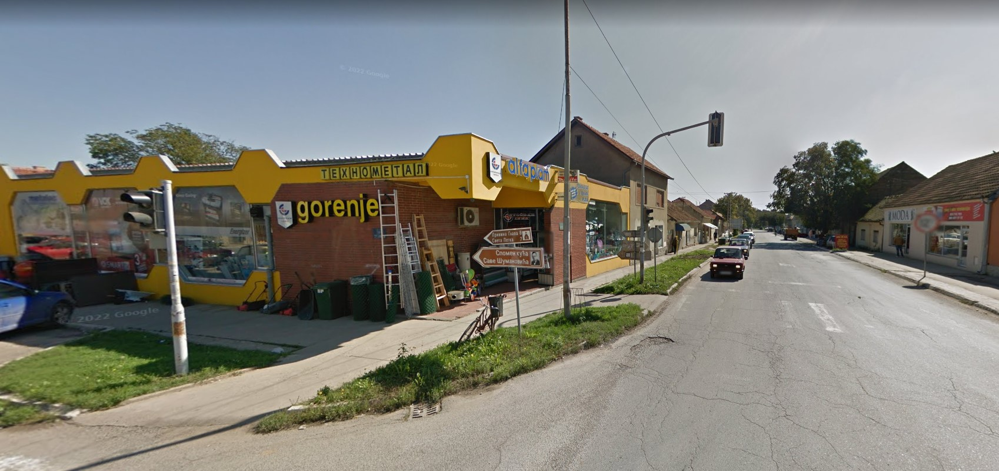

# Izveštaj OS INT & Pirates of the Memorial

---

## 1. OS INT

**Flag Format:** `UNS{}`

### Dokumentacija

#### Slika 1
  
Na slici je putokaz za **spomen kuću Save Šumanovića**.

#### Slika 2
  
Na internetu sam shvatio da se spomen kuća nalazi u **Šidu**.

#### Slika 3
  
Na slici je i **Tehnometal**, pa sam na mapi pronašao tačnu lokaciju na **satelitskom prikazu**.  
Postavio sam **čovečuljka** koji me je doveo na tačnu raskrsnicu.

#### Slika 4
  
U URL kodu su ispisane **koordinate** lokacije.

**Zaključak:** Zadatak OS INT je uspešno završen.

---

## 2. Pirates of the Memorial

**Flag Format:** `csictf{}`

### Dokumentacija

#### Slika 1
  
Na početnoj slici je predmet zadatka koji sam analizirao.

Pretraživanjem putem Google pretrage došao sam do relevantnih izvora koji ukazuju na poreklo slike.

#### Slika 2
  
Našao sam Twitter post koji sadrži informaciju gde je u objavi je navedeno **ime osobe koja je fotografisala sliku**.

#### Slika 3
  
Na njegovom Instagram profilu sam našao flag u formatu: `csictf{}`.

**Zaključak:** Flag je uspešno pronađen i zadatak je završen.

## 3. Sakura Room

### Zadatak 1 — Ispisati poruku
#### Slika 8
  
Na slici je rezultat prvog zadatka: ispisana poruka **"Lets Go!"**.

### Zadatak 2 — Pronaći attackera / poreklo slike
#### Slika 9
  
Ovo je slika koju je attacker ostavio / koja je povezana sa incidentom.

#### Slika 10
  
Detaljnim inspektovanjem i pretragom pronašao sam poreklo slike tj izvor koji povezuje sliku sa autorom/attack-om je dokumentovan na ovoj slici.

**Zaključak:**  
- Prvi zadatak (ispis poruke) je potvrdno izvršen — **"Lets Go!"**.  
- Drugi zadatak je završen: identifikovao sam poreklo slike i osobu koji je ostavio sliku.

---