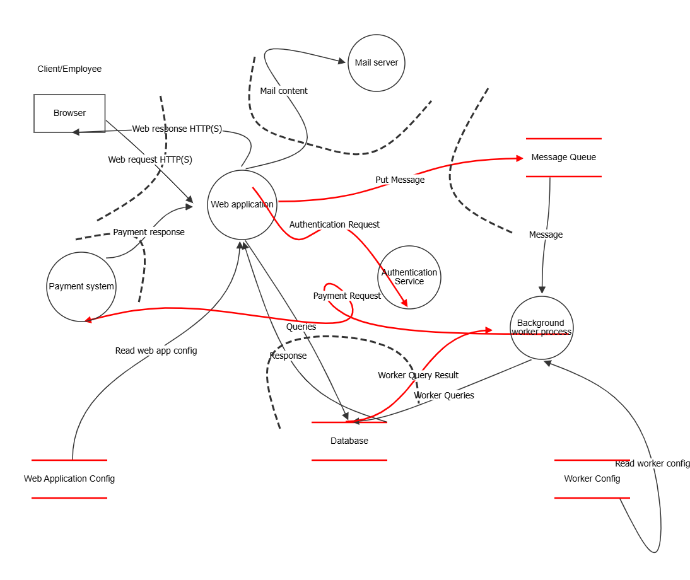

# Motivacija napadača

Razmatrajući potencijalne napadače na sistem *MegaTravel*, moguće je izdvojiti nekoliko grupa napadača, njihove nivoe veština, načine pristupa sistemu i krajnje ciljeve:

1. **Zlonamerni hakeri (*cyber* kriminalci)**  
   * **Motivacija:** Finansijska dobit. Žele da ukradu podatke o korisnicima, posebno finansijske informacije (podatke o kreditnim karticama, brojeve pasoša i druge lične podatke).  
   * **Nivo veštine:** Srednji do visoki. Mogu koristiti poznate ranjivosti, ali i napredne metode (*phishing* [\[1\]](#bookmark=id.9j7pihvp1afo)*, SQL injection* [\[2\]](#bookmark=id.hosyyvr87pv6)*, malware* [\[3\]](#bookmark=id.pp50vowtl9wi)*, ransomware* [\[4\]](#bookmark=id.6ucer5yi7okz)).  
   * **Pristup sistemu:** Eksterni. Napadi dolaze spolja, često putem interneta.  
   * **Ciljevi:**  
     * Krađa ličnih i finansijskih podataka.  
     * Prodaja ukradenih podataka na crnom tržištu.  
     * Ucenjivanje (npr. *ransomware* [\[4\]](#bookmark=id.6ucer5yi7okz))

2. **Insajderi (nezadovoljni zaposleni ili bivši zaposleni):**  
   * **Motivacija:** Osveta, nezadovoljstvo, lična korist.  
   * **Nivo veštine:** Nizak do srednji. Poznaju sistem iznutra, te postoji mogućnost zloupotreba internih privilegija.  
   * **Pristup sistemu:** Interni. Imaju direktan pristup sistemima, podacima ili mreži.  
   * **Ciljevi:**  
     * Sabotiranje poslovanja.  
     * Iznošenje poverljivih informacija.  
     * Krađa podataka o klijentima, partnerima ili kompaniji.

3. **Konkurentske kompanije (industrijska špijunaža):**  
   * **Motivacija:** Pribavljanje poslovnih tajni, strategija, ugovora, planova i korisničkih podataka.  
   * **Nivo veštine:** Srednji do visoki (mogu angažovati stručne hakere).  
   * **Pristup sistemu:** Eksterni, često prikriven (putem *phishing*\-a [\[1\]](#bookmark=id.9j7pihvp1afo), lažnih zaposlenih ili društvenog inženjeringa).  
   * **Ciljevi:**   
     * Pristup internim dokumentima i analizama.  
     * Sabotiranje reputacije *MegaTravel*\-a.  
     * Krađa inovativnih ideja i planova.

4. **Skripter kidiji (*script kiddies*** [\[5\]](#bookmark=id.c8qnmfohjgg3)**):**  
   * **Motivacija:** Dosada, dokazivanje, slava u hakerskoj zajednici.  
   * **Nivo veštine:** Nizak. Koriste gotove alate i skripte.  
   * **Pristup sistemu:** Eksterni.  
   * **Ciljevi:**   
     * Prekid rada sistema.  
     * *Defacement* sajta (promena izgleda)  
     * Ostavljanje tragova upada (tzv. *tagging* [\[6\]](#bookmark=id.3ab0es440kvz))

5. **Aktivisti (*Hacktivists*):**  
   * **Motivacija:** Politički ili ideološki motivisana akcija (npr. protiv korporacija, globalizacije, ekološki ciljevi)  
   * **Nivo veštine:** Srednji.  
   * **Pristup sistemu:** Eksterni.  
   * **Ciljevi:**  
     * Javno kompromitovanje kompanije (objavljivanje podataka).  
     * Sabotiranje usluga (npr. DDoS napadi [\[7\]](#bookmark=id.kf1b70yh5v57)).  
     * Skretanje pažnje na politička pitanja

6. **Državni akteri (državno sponzorisani napadači):**  
   * **Motivacija:** Geopolitički interesi, špijunaža, destabilizacija tržišta.  
   * **Nivo veštine:** Visoki. Koriste *zero-day vulnerabilities* [\[8\]](#bookmark=id.5m366b84tyyk) i napredne napade (*APT, Advanced Persistent Threat* [\[9\]](#bookmark=id.wzytwppv6tp3)).  
   * **Pristup sistemu:** Eksterni, ali sofisticiran.  
   * **Ciljevi:**   
     * Pristup informacijama o građanima, diplomatama ili strateškim podacima.  
     * Sabotiranje međunarodnog poslovanja.  
     * Uticaj na stabilnost država ili tržišta u kojima posluje *MegaTravel*.

*Tabela 1\. Tabela pregleda napadača*

| Klasa napadača | Nivo veštine | Pristup | Glavni ciljevi |
| :---: | :---: | :---: | :---: |
| *Cyber* kriminalci | Srednji do visok | Eksterni  | Finansijska dobit, krađa podataka |
| Insajderi  | Nizak do srednji | Interni  | Osveta, sabotaža |
| Konkurencija  | Srednji do visok | Eksterni | Špijunaža, kompromitacija |
| Skripter kidiji (*script kiddies*) | Nizak  | Eksterni  | Slava, zabava |
| Aktivisti (*hacktivists*) | Srednji  | Eksterni | Ideološki protesti |
| Državni akteri | Visok | Eksterni | Špijunaža, geopolitički ciljevi |

## Dodatna objašnjenja

* ***Phishing:*** Prevara kojom se korisnici navode da otkriju poverljive informacije, obično putem lažnih i-mejlova ili sajtova [\[1\]](#bookmark=id.9j7pihvp1afo).  
* ***SQL Injection:*** Napad kojim se zlonamerni SQL kod unosi u bazu podataka kroz ranjive forme [\[2\]](#bookmark=id.hosyyvr87pv6).  
* **Malver (*malware*):** Zlonamerni softver koji može izazvati štetu na računaru korisnika ili ukrasti podatke [\[3\]](#bookmark=id.pp50vowtl9wi).  
* ***Ransomware:*** Tip malvera koji zaključava fajlove korisnika i traži otkup [\[4\]](#bookmark=id.6ucer5yi7okz).  
* ***Script kiddies:*** Napadači bez većeg znanja koji koriste gotove alate [\[5\]](#bookmark=id.c8qnmfohjgg3).  
* ***Tagging (defacement):*** Promena izgleda sajta radi ostavljanja poruke ili potpisa [\[6\]](#bookmark=id.3ab0es440kvz).  
* ***DDoS (Distributed Denial of Service):*** Napad pri kome veliki broj kompromitovanih uređaja (botova) istovremeno šalje zahteve serveru ili mreži sa ciljem da preoptereti sistem i onemogući pristup legitimnim korisnicima [\[7\]](#bookmark=id.kf1b70yh5v57).  
* ***Zero-day vulnerabilities:*** Bezbednosni propusti koji nisu javno prepoznati ili zakrpljen [\[8\]](#bookmark=id.5m366b84tyyk).  
* ***Advanced Persistent Threats (APT):*** Dugotrajne, ciljno usmerene pretnje koje sprovode organizovani ili državno podržani napadači [\[9\]](#bookmark=id.wzytwppv6tp3).

# B. Osetljiva imovina MegaTravel-a 

U okviru procesa modelovanja pretnji (Threat Modeling), jedan od ključnih koraka je identifikacija i analiza osetljive imovine (assets). Ovaj korak je od suštinskog značaja za razumevanje potencijalnih rizika i prioritizaciju bezbednosnih mera. Kompanija MegaTravel, kao međunarodni lider u oblasti turističkih usluga, obrađuje veliki broj ličnih i poslovnih podataka korisnika, koristi kompleksnu infrastrukturu i sarađuje sa brojnim eksternim partnerima. Imajući u vidu različite vrste napadača, njihove ciljeve i motivaciju, kao i zakonske okvire kao što su GDPR i PCI DSS, u nastavku sledi detaljna analiza ključne imovine MegaTravel sistema. 

## 1\. Baza podataka korisnika (User Database) 

* **Inherentna izloženost:** Pristup ovoj bazi podataka imaju backend serveri aplikacije, sistem administratori i određeni članovi IT tima sa odgovarajućim privilegijama. Odnosno ovlašćeno IT osoblje.   
* **Bezbednosni ciljevi (CIA):**   
* *Poverljivost:* Baza sadrži lične podatke korisnika (ime, adresa, pasoš, podaci o plaćanju), čija zaštita je obavezna po zakonu.   
* *Integritet:* Neophodno je očuvanje tačnosti i konzistentnosti svih podataka.   
* *Dostupnost:* Sistem mora biti uvek dostupan bez prekida za potrebe rezervacija i korisničke podrške, odnosno omogućavati pristup korisničkim podacima.   
* **Uticaj narušavanja:**   
* Povreda poverljivosti može dovesti do narušavanja privatnosti korisnika, što može izazvati ozbiljne pravne posledice i dovesti do sudskih tužbi, kazni (npr. prema GDPR) kao i gubitka reputacije.   
* Povreda integriteta može uzrokovati greške u rezervacijama i stoga dovesti do pogrešnih rezervacija i nezadovoljstva korisnika i gubitak poverenja.   
* Nedostupnost baze blokira celokupnu funkcionalnost sistema. 

## 2\. Rezervacioni sistem (Reservation System) 
Web aplikacija (frontend i backend logika za rezervacije)  
API servisi koji komuniciraju sa korisnicima i partnerima  
Mikroservisi za obradu, potvrdu i otkazivanje rezervacija  
Baza podataka rezervacija (korisnici, destinacije, datumi, cene, statusi – potvrđeno/otkazano)

* **Inherentna izloženost:** Rezervacioni sistem je dostupan korisnicima putem interneta, kao i putem API-ja za partnere (interne servise).   
* **Bezbednosni ciljevi (CIA):**   
* *Poverljivost:* Čuva informacije i detalje o putovanjima korisnika i partnera.   
* *Integritet:* Mora osigurati tačnost svih rezervacija (datuma, destinacija, cena i uslova) i termina.   
* *Dostupnost:* Neophodno je neprekidno funkcionisanje kako bi korisnici mogli da pristupe uslugama. Dakle, mora biti dostupan 24/7.   
* **Uticaj narušavanja:**   
* Napad koji menja rezervacije i dovodi do pogrešnih može izazvati logistički haos.   
* Nedostupnost direktno utiče na prihode kompanije i korisničko zadovoljstvo. 

## 3\. Sistem plaćanja (Payment Gateway) 

* **Inherentna izloženost:** Pristupaju mu krajnji korisnici, finansijski provajderi (finansijske institucije) i interni procesni sistemi (integrisani partneri).   
* **Bezbednosni ciljevi (CIA):**   
* *Poverljivost:* Mora štititi podatke o kreditnim  karticama, brojevima računa i drugim platnim metodama.   
* *Integritet:* Svaka transakcija mora biti verifikovana i precizna. Iznosi i transakcije ne smeju biti izmenjeni.   
* *Dostupnost:* Plaćanje mora biti omogućeno u svakom trenutku.   
* **Uticaj narušavanja:**   
* Krađa finansijskih podataka može izazvati pravne posledice i gubitak poverenja odnosno reputacionu štetu.   
* Neuspeh transakcija i nemogućnost plaćanja onemogućava ostvarivanje prihoda (gubitak profita). 

## 4\. Poslovni i logistički podaci 

* **Inherentna izloženost:** Dostupni isključivo višem menadžmentu i odabranim zaposlenima.   
* **Bezbednosni ciljevi (CIA):**   
* *Poverljivost:* Obuhvata strateške dokumente, ugovore sa partnerima, strategije i interni know-how.   
* *Integritet:* Tačnost ovih podataka je presudna za donošenje odluka.   
* *Dostupnost:* Potrebni su u realnom vremenu za poslovne operacije.  
* **Uticaj narušavanja:**   
* Povreda može dovesti do industrijske špijunaže ili curenja podataka i konkurentske prednosti za druge firme. Time biva ugrožena tržišna pozicija kompanije. 

## 5\. E-mail sistem i komunikacija zaposlenih 

* **Inherentna izloženost:** Pristupaju mu svi zaposleni unutar kompanije. Svako svom e-mail nalogu.   
* **Bezbednosni ciljevi (CIA):**   
* *Poverljivost:* Obuhvata internu komunikaciju i razmenu sa klijentima.   
* *Integritet:* Potrebno je osigurati verodostojnost (autentičnost) poruka.   
* *Dostupnost:* Komunikacija mora teći bez prekida.   
* **Uticaj narušavanja:**   
* Mogućnost phishing napada, curenja poverljivih informacija i zlonamerne manipulacije sadržajem.   
* Prekid u komunikaciji remeti poslovne procese. 

## 6\. Web server i korisnička aplikacija (Front-end) 

* **Inherentna izloženost:** Direktno izloženi internetu i dostupni krajnjim korisnicima širom sveta.   
* **Bezbednosni ciljevi (CIA):**   
* *Poverljivost:* Zaštita korisničkih sesija i autentifikacionih tokena.   
* *Integritet:* Web stranice i aplikacija moraju biti autentične i izmenama otporne. Odnosi se na kôd aplikacije i interfejse.   
* *Dostupnost:* Ključno za pružanje usluga 24/7.   
* **Uticaj narušavanja:**   
* Defacement sajta, DDoS napadi ili zlonamerni kod mogu narušiti korisničko iskustvo i poverenje što utiče na ugled i funkcionalnost sistema. 

### E. Pretnje i mitigacije \- STRIDE metodologija (za svako sredstvo imovine)

---

| Slovo | Pretnja | Objašnjenje |
| ----- | ----- | ----- |
| **S** | **Spoofing** | Lažno predstavljanje korisnika ili sistema radi pristupa resursima. |
| **T** | **Tampering** | Neovlašćena izmena podataka ili koda. |
| **R** | **Repudiation** | Poricanje izvršene akcije bez dokaza (npr. korisnik poriče plaćanje). |
| **I** | **Information Disclosure** | Neovlašeno otkrivanje poverljivih informacija. |
| **D** | **Denial of Service (DoS)** | Sprečavanje legitimnog korišćenja sistema ili resursa. |
| **E** | **Elevation of Privilege** | Neovlašeno sticanje višeg nivoa pristupa nego što je dozvoljeno. |

---

### 1\. Baza korisnika

* **Pretnje (STRIDE):**

  * *Spoofing:* Lažno predstavljanje korisnika radi pristupa podacima.

  * *Information Disclosure:* Curenje ličnih podataka.

  * *Tampering:* Neautorizovana izmena korisničkih podataka.

* **Mitigacije:**

  * **Višefaktorska autentifikacija.**

Umesto da se korisnik identifikuje samo pomoću lozinke (nešto što zna-  lozinka, PIN), višefaktorska autentifikacija dodaje još **jedan ili više faktora** (nešto što imaš \- mobilni telefon, token, smart kartica; nešto što jesi \- otisak prsta, prepoznavanje lica).

Čak i ako napadač sazna korisničku lozinku, neće moći da pristupi nalogu bez drugog faktora (npr. koda sa telefona), čime se **drastično smanjuje rizik od spoofinga**.

* **Enkripcija u mirovanju i prenosu (Encryption at rest and in transit)**

**Enkripcija u mirovanju (at rest):**  
Podaci u bazi su šifrovani čak i kada nisu u upotrebi. Ako neko fizički dođe do fajla baze podataka, ne može da ga pročita bez ključa.  
 ➤ Primer: AES-256 enkripcija baze.

**Enkripcija u prenosu (in transit):**  
Kada podaci putuju između klijenta i servera (npr. login podaci), oni su šifrovani korišćenjem TLS/SSL (HTTPS), pa niko "između" ne može da ih presretne.  
 ➤ Primer: HTTPS sa TLS 1.2/1.3.

* **Kontrola pristupa (RBAC)**

RBAC je mehanizam koji definiše **ko može da radi šta u sistemu** na osnovu svoje uloge (npr. **korisnik** može menjati samo svoje podatke, **admin** može upravljati korisnicima, ali ne vidi njihove lozinke, **baza** se može menjati samo putem verifikovanog API-ja). Ako korisnik **nema prava da izmeni određene podatke**, ni slučajno ni zlonamerno ne može to da uradi. RBAC sprečava greške, sabotaže i neautorizovani pristup.  
Npr: U MegaTravel aplikaciji g**uest** ima samo pravo pregleda sadržaja, **registered user** može praviti rezervacije, plaćati i ostavljati recenzije, **partner (npr. vlasnik smeštaja)** upravlja sopstvenim ponudama i vidi rezervacije koje se njega tiču, **support agent** pomaže korisnicima i rešava probleme, ali nema pristup plaćanjima, **administrator** ima potpuni pristup svim podacima i sistemskim podešavanjima, **system (servisi)** automatski obrađuje rezervacije i šalje notifikacije, uz ograničen tehnički pristup.  
Svaka uloga ima jasno definisane dozvole prema principu "najmanjih privilegija" radi bezbednosti.

### 2\. Rezervacioni sistem

* **Pretnje:**

  * *Tampering:* Neautorizovana promena rezervacija.

  * *Denial of Service (DoS):* Sistem postaje nedostupan.

* **Mitigacije:**

  * **Validacija ulaza (input validation)**

Ako sistem **ne proverava šta korisnik unosi**, onda **zlonamerni korisnik može manipulisati podacima** (npr. u browseru, kroz "Inspect Element", Postman, ili skriptama) i poslati **namerne, nevažeće ili opasne vrednosti**.

- Negativna cena, nepravilan datum: **Business logic attack**.  
- ' OR 1=1 – : **SQL Injection**. Može da izvrši SQL kod koji vrati sve rezervacije, izbriše podatke, ili izmeni tuđe podatke.  
  * **Rate limiting, CAPTCHA zaštita**  
* **Rate limiting:** Ograničava broj zahteva koje korisnik može da pošalje u određenom vremenu (npr. najviše 5 rezervacija u minuti).  
* **CAPTCHA:** Pita korisnika da dokaže da je čovek (npr. klikni na semafore) pre nego što nastavi.  
* Štite od **DoS napada** i **automatskih botova** koji pokušavaju da preopterete server ili da masovno prave rezervacije.

(Ako neko pokuša da pošalje 1000 zahteva za rezervaciju u sekundi \- sistem automatski blokira ili usporava te zahteve).

* **Redudantni serveri (failover)**

Sistem ima više servera spremnih da preuzmu posao ako jedan padne (npr. backup serveri, klasteri, load balancing). Štite od **DoS napada i hardverskih kvarova**, jer omogućavaju da sistem nastavi da radi čak i ako jedan deo infrastrukture zakaže.

### 3\. Sistem za plaćanje

* **Pretnje:**

  * *Information Disclosure:* Krađa finansijskih podataka.

  * *Repudiation:* Korisnik poriče da je izvršio plaćanje.

  * *Tampering:* Promena iznosa u toku transakcije.

* **Mitigacije:**

  * **Tokenizacija i PCI-DSS usklađenost**

Štiti od Information Disclosure (štite korisničke kartice i finansijske informacije od curenja ili krađe).

* **Tokenizacija** zamenjuje osetljive podatke (npr. broj kartice) sa **nasumičnim tokenima** koji **nemaju vrednost van sistema** (`4111-1111-1111-1111` ➝ `tok_9f82hf2u).` Ako napadač ukrade token **ne može ga iskoristiti** bez konteksta sistema.

* **PCI-DSS (Payment Card Industry Data Security Standard)** je skup obaveznih standarda za zaštitu kartičnih podataka (Enkripcija, Ograničen pristup, Redovno testiranje ranjivosti, Mrežna segmentacija).

  * **Digitalni potpisi transakcija**

**Digitalni potpis** je kriptografski mehanizam koji **dokazuje autentičnost i integritet poruke ili transakcije** (privatni/javni ključ).

* **Logovanje i auditing sistema**

Štiti od Repudiation i Tampering. Sistem vodi **detaljne zapise (logove)** o svakoj transakciji, vremenu, IP adresi, korisniku, svakoj izmeni, pokušaju pristupa ili grešci.  
**Audit trail** (trag provere) omogućava da se svaki događaj **rekonstruiše kasnije**, detektuje zloupotreba,  pravno dokaže ko je i kada šta uradio.  
Sprečava korisnike da **poriču radnje**, i omogućava detekciju **zlonamernih izmena** u sistemu.

### 4\. Interna poslovna dokumentacija

 Obuhvata strateške dokumente, ugovore sa partnerima, strategije i interni know-how.
 
* **Pretnje:**

  * *Information Disclosure:* Industrijska špijunaža.

  * *Elevation of Privilege:* Neovlašćeni pristup internim fajlovima.

* **Mitigacije:**

  * **Slojeviti pristup (least privilege)**

Štiti od Elevation of Privilege.

* Pristup dokumentima se zasniva na **potrebi za rad** \- korisnik **dobija pristup samo onome što mu je neophodno**.  
  Na primer **zaposleni u korisničkoj podršci** ne vidi finansijske izveštaje, **partner** ne vidi strategiju razvoja tržišta.  
  Time se sprečava da neko sa manje privilegija „zaluta” u delove sistema koje **ne bi smeo ni da vidi**, a kamoli da menja.

  * **Šifrovana interna komunikacija.**

Štiti od Information Disclosure.

Svi fajlovi i komunikacija (mejlovi, interne poruke, prenos fajlova) **moraju biti šifrovani**, čak i unutar organizacije.

Koriste se standardi kao što su:

* **TLS** za mrežnu komunikaciju,

* **AES-256** za enkripciju fajlova u mirovanju,

* VPN za pristup internoj mreži spolja.

  * **Monitoring pristupa i audit trail**

Štiti od Information Disclosure, Elevation of Privilege.

Sistem beleži:

* Ko je pristupio kom dokumentu,

  * Kada i odakle (IP adresa),

  * Da li je samo čitao, menjao ili brisao dokument.

Svi osetljivi pristupi se **automatski evidentiraju**, a neuobičajeno ponašanje (npr. previše downloada) može pokrenuti **alarm ili istragu**. Omogućava **pravovremenu reakciju** i **dokazivanje** ako dođe do incidenta.

### 5\. E-mail sistem

**Pretnje:**

* *Spoofing:* Lažni pošiljaoci mejlova.

* *Phishing:* Prevara zaposlenih da odaju informacije.

**Mitigacije:**

* **SPF, DKIM zaštita**

**SPF (Sender Policy Framework)**

* SPF je mehanizam koji omogućava serverima da provere da li je IP adresa sa koje je stigao mejl ovlašćena da šalje mejlove u ime određenog domena.  
  Ako neko pokuša da pošalje lažni mejl (spoofing) sa tvog domena, primaoci mogu da otkriju da mejl nije sa legitimnog servera i da ga odbace ili označe kao sumnjiv.

**DKIM (DomainKeys Identified Mail)**

* DKIM dodaje digitalni potpis u zaglavlje mejla, koji omogućava primaocu da proveri da li mejl stvarno potiče sa domena pošiljaoca i da li nije izmenjen tokom prenosa. Pomaže u sprečavanju lažnog predstavljanja (spoofinga) i osigurava integritet sadržaja mejla.

  * **Antivirus i anti-phishing alati**

**Antivirus softver** skenira dolazne mejlove i priloge u potrazi za malicioznim kodom, virusima, trojancima ili drugim štetnim programima koji mogu ugroziti računar ili mrežu.

**Anti-phishing alati** automatski detektuju sumnjive ili lažne mejlove koji pokušavaju da prevarom (phishing) od korisnika izvuku poverljive informacije poput lozinki, brojeva kartica i sl.

Ovi alati mogu blokirati takve mejlove, upozoriti korisnika ili ih automatski preusmeriti u posebnu fasciklu za sumnjive mejlove.

* **Obuka zaposlenih o bezbednosti**

Čak i sa svim tehničkim merama, ljudski faktor je često najslabija karika. Zaposleni treba da budu edukovani kako da prepoznaju sumnjive mejlove, phishing pokušaje, lažne linkove i priloge.

### Trust Boundaries (Granice poverenja)

* Granica između korisničkog browsera i Web aplikacije (nepoveren korisnik).

* Granica između aplikacionog sloja i baze podataka.

* Granica između Web aplikacije i platnog provajdera (eksterni entitet).

* Granica između interne mreže i eksternih sistema (DMZ).

# Tipovi korisnika i sistema koji komuniciraju sa MegaTravel sistemom

Na osnovu opisa sistema i u skladu sa OWASP principima bezbednosnog dizajna, izdvajamo su sledeće korisnike i eksterni akteri:

## Ljudski korisnici

* Krajnji korisnici (putnici) – pristupaju sistemu preko web/mobilne aplikacije da bi pretraživali, rezervisali i planirali odmor.

* Zaposleni u MegaTravel-u – koriste administrativne interfejse i alate za rad sa rezervacijama, korisnickim nalozima i konfiguracijom sistema.

* Partneri (hoteli, aviokompanije, agencije) – imaju interfejse za sinhronizaciju ponuda i dostupnosti kapaciteta.

## Sistemi i servisi

* Platni procesori – omogućavaju procesiranje online plaćanja.

* OAuth i SSO servisi – koriste se za autentifikaciju korisnika preko trećih strana (Google, Facebook itd).

* Marketing i analitika alati – prate ponašanje korisnika u cilju optimizacije usluga i personalizacije sadržaja.

* CI/CD i DevOps alati – koriste se za isporuku softverskih komponenti i konfiguraciju sistema.

# Površina napada – Identifikacija ulaznih tačaka

Na osnovu interakcije gore navedenih korisnika i sistema sa MegaTravel infrastrukturom, pronašli smo sledeće ulazne tačke koje čine površinu napada:

## 1. Web aplikacija i REST API

 ### Opis: Omogućava korisnicima pretragu, rezervaciju i upravljanje nalozima.

 ### Ulazne tačke:

* HTTPS zahtevi

* Forme za unos podataka

* API endpointi za rezervacije, plaćanja, pretrage

 ### Rizici:

* SQL Injection

* XSS, CSRF

* Neautorizovani pristup API funkcionalnostima

### Zaključak: Kao najčesće korisćena komponenta, predstavlja najveću površinu napada. Potrebno je implementirati strong input validation, rate limiting i authentication middleware.

## 2. Admin portali

### Opis: Koriste ih zaposleni i partneri za upravljanje podacima i rezervacijama.

### Ulazne tačke:

* Web login

* Backend dashboard funkcionalnosti

### Rizici:

* Privilege escalation

* Brute-force napadi

* Konfiguracione greške

### Zaključak: Potrebno je uvesti dvofaktorsku autentifikaciju i audit logove za sve administrativne aktivnosti.

## 3. Webhook endpointi za plaćanja

### Opis: Platni procesori šalju notifikacije o statusima transakcija.

### Ulazne tačke:

* Webhook endpointi

### Rizici:

* Lažni zahtevi (spoofing)

* Replay attacks

### Zaključak: Implementacija verifikacije potpisa i provera IP adresa procesora je ključna.

## 4. Partner API integracije

### Opis: Uvoze podatke o dostupnosti kapaciteta u realnom vremenu.

### Ulazne tačke:

* API pozivi

### Rizici:

* Nevalidni XML/JSON payloadi

* Poverenje u neproverene partnere

### Zaključak: Obezbediti sandbox okruženje i validaciju ulaza pre dalje obrade.

## 5. OAuth SSO endpointi

### Opis: Korisnici se autentifikuju preko trećih strana.

### Ulazne tačke:

* OAuth redirect/callback

### Rizici:

* Token substitution

* Open redirect napadi

### Zaključak: Obavezna validacija state parametra i ograničavanje dozvoljenih redirect URI-jeva.

## 6. Email tokeni i linkovi

### Opis: Linkovi za potvrdu rezervacija i resetovanje lozinki.

### Ulazne tačke:

* GET zahtevi sa tokenima

### Rizici:

* Phishing

* Token leakage

### Zaključak: Tokeni moraju biti vremenski ograničeni i jednokratni.

## 7. Agent desktop aplikacije (call centar)

### Opis: Interfejsi za zaposlene operatere.

### Ulazne tačke:

* Interni dashboardi

### Rizici:

* Insider threat

* Greške operatera

### Zaključak: Uvesti granularnu kontrolu pristupa (least privilege) i nadzor.

## 8. CI/CD i repozitorijumi

### Opis: Automatizovano postavljanje aplikacija i konfiguracija.

### Ulazne tačke:

* Git webhookovi, build serveri

### Rizici:

* Secrets leakage

* Neautorizovani push koda

### Zaključak: Svi tajni podaci moraju biti van koda (npr. vault), uz obaveznu proveru PR-ova i CI logova.

# Zaključak

* Web aplikacija i REST API su najveća površina napada i zahtevaju najveću paznju.

* Interfejsi za integraciju sa trećim stranama (plaćanja, partneri) otvaraju mogućnosti za sofisticirane napade i zahtevaju digitalne potpise, autentifikaciju i sandbox validaciju.

* Administrativni portali i agent alati zahtevaju strogu kontrolu pristupa, auditovanje i obaveznu autentifikaciju u više koraka.

* DevOps alati i repozitorijumi predstavljaju supply chain attack rizik i moraju biti adekvatno izolovani i nadgledani.

* Pokrivanje ovih povrsina kroz principe sigurnog dizajna, primenu OWASP praksi i automatizovane provere predstavlja minimalni prag bezbednosti za MegaTravel sistem.

# Korisćeni izvori:

1. [NCSC \- UK: Phishing](https://www.ncsc.gov.uk/guidance/phishing)  
2. [OWASP: SQL Injection](https://owasp.org/www-community/attacks/SQL_Injection)  
3. [IBM: What is malware?](https://www.ibm.com/think/topics/malware)  
4. [CISA: Ransomware guide](https://www.cisa.gov/stopransomware/ransomware-guide)  
5. [Malwarebytes: What is a script kiddie?](https://www.malwarebytes.com/cybersecurity/basics/script-kiddie)  
6. [Wikipedia: Website defacement](https://en.wikipedia.org/wiki/Website_defacement)  
7. [Cloudflare: What is a DDoS attack?](https://www.cloudflare.com/learning/ddos/what-is-a-ddos-attack/)  
8. [Wikipedia: Zero-day vulnerability](https://en.wikipedia.org/wiki/Zero-day_vulnerability)  
9. [Kaspersky: What is APT (Advanced Persistent Threat)?](https://www.kaspersky.com/resource-center/definitions/advanced-persistent-threats)  
10. [Microsoft. “Threat Modeling: STRIDE Approach.”](https://learn.microsoft.com/en-us/security/compass/stride-threat-modeling)  
11. [OWASP Foundation. “OWASP Top Ten Security Risks.”](https://owasp.org/www-project-top-ten/)   
12. [Google reCAPTCHA](%20https://www.google.com/recaptcha/about/)

OWASP Top Ten: https://owasp.org/www-project-top-ten/

OWASP API Security Top 10: https://owasp.org/www-project-api-security/

OAuth 2.0 Security BCP: https://datatracker.ietf.org/doc/html/draft-ietf-oauth-security-topics

OWASP Cheat Sheet Series: https://cheatsheetseries.owasp.org/

Stripe Webhook Security: https://stripe.com/docs/webhooks

NIST SP 800-61 Incident Handling Guide: https://nvlpubs.nist.gov/nistpubs/SpecialPublications/NIST.SP.800-61r2.pdf

CI/CD Security Risks: https://www.techtarget.com/searchitoperations/tip/9-ways-to-infuse-security-in-your-CI-CD-pipeline
