# Authentication klasa napada

## Objašnjenje klase napada

Napadi na autentifikaciju ciljaju proces prijavljivanja korisnika na
sistem.

Napadač pokušava da prevari sistem kako bi pristupio tuđim nalozima,
često koristeći:

- ***Brute-force*** -- pokušaj svih kombinacija korisničkog imena i
  lozinke (ručno ili uz korišćenje specijalizovanih alata, što je danas
  češći slučaj)

- ***Credential stuffing*** -- ponovno korišćenje kompromitovanih
  lozinki sa drugih servisa

- ***Username enumeration*** -- otkrivanje validnih korisničkih imena
  kroz različite odgovore servera

Cilj je neautorizovani pristup korisničkom nalogu ili privilegovanim
funkcijama.

## Uticaj uspešnog napada

Posledice ovakvog napada mogu biti ozbiljne. Neautorizovan pristup
korisničkom nalogu znači da napadač može videti privatne podatke,
menjati sadržaj naloga, pa čak i zloupotrebiti nalog za dalje napade.
Ako se kompromituje administratorski nalog, cela aplikacija može biti
ugrožena -- od curenja podataka, do kompletnog gubitka kontrole nad
sistemom.

## Ranjivosti koje omogućavaju napad

Ono što često omogućava ovakve napade su loše implementirane zaštite. Na
primer, različite poruke greške za pogrešno korisničko ime i lozinku,
odsustvo ograničenja broja pokušaja logovanja, ili lozinke koje su
previše jednostavne i lake za pogađanje. Takođe, izostanak dodatnih
slojeva zaštite, poput dvofaktorske autentifikacije, daje napadaču mnogo
više prostora za manevrisanje.

## Kako sprečiti napade

Kako bi se sprečili ovakvi napadi, potrebno je primeniti više kontramera
istovremeno. Neke od mogućih kontramera su:

- ***Rate limiting / throttling*** -- ograničavanje broja pokušaja
  logovanja po korisniku ili IP adresi.

- ***Account lockout policies*** -- privremeno blokirati nalog nakon
  određenog broja neuspelih pokušaja logovanja.

- ***Uniform error messages*** -- ne razlikovati odgovore za nevalidno
  korisničko ime i pogrešnu lozinku.

- ***Strong password policies*** -- minimalna dužina, kombinacija
  velikih i malih slova, brojeva i specijalnih karaktera.

- ***Multi-factor authentication (MFA / 2FA)*** -- dodaje dodatni sloj
  zaštite čak i ako je lozinka kompromitovana.

- ***Monitoring & alerting*** -- detektovanje neuobičajenih pokušaja
  prijavljivanja i obaveštavanje korisnika ili administratora o tome.

- ***CAPTCHA*** -- dodati kod više neuspelih pokušaja da se spreče
  automatizovani napadi.

## Lab: Username Enumeration via Different Responses

U ovom zadatku istraživali smo ranjivost sistema koja omogućava
**enumeraciju korisničkih imena** putem različitih odgovora servera, kao
i brute-force napad na lozinke. Cilj je bio pronaći validno korisničko
ime, zatim pogoditi lozinku i uspešno pristupiti korisničkom nalogu.

### Opis napada:

Napad se započinje tehnikom *username enumeration*. Server daje
različite odgovore u zavisnosti od toga da li uneseno korisničko ime
postoji ili ne. Na osnovu ovih razlika u porukama ili dužini odgovora,
moguće je identifikovati validno korisničko ime iz liste kandidata. Kada
se validno korisničko ime otkrije, sledeći korak je ***brute-force***
**napad na lozinku**, pri čemu se sistematski isprobavaju lozinke iz
ponuđene liste dok se ne pronađe ispravna.

### Rešenje zadatka:

1.  ***Username enumeration:***

    a.  Prvo smo otvorili login stranicu u Burp Suite-ovom ugrađenom
        pretraživaču.

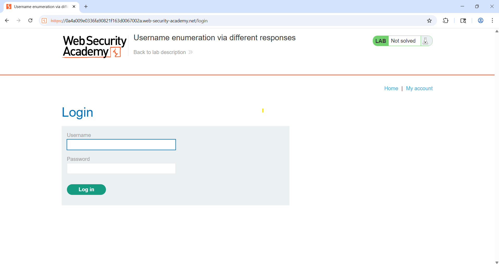

*Slika 1. Login stranica u Burp Suite-ovom ugrađenom Chromium
pretraživaču*

b.  HTTP intercept smo isključili dok se stranica učitavala, a zatim smo
    ga uključili pre slanja forme za prijavu kako bi Burp mogao da
    presretne POST zahtev za login.

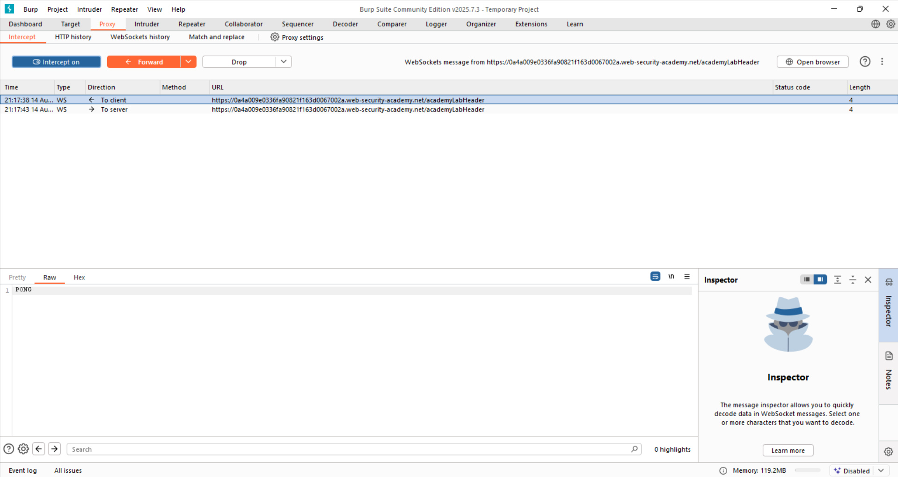

*Slika 2. Burp Suite-ov Proxy tab sa uključenim HTTP interceptom*

c.  Zatim smo pokušali da se prijavimo na sistem koristeći nasumično
    odabrane vrednosti za korisničko ime i lozinku (konkretno, postavila
    sam vrednost *test* i za korisničko ime i za lozinku)

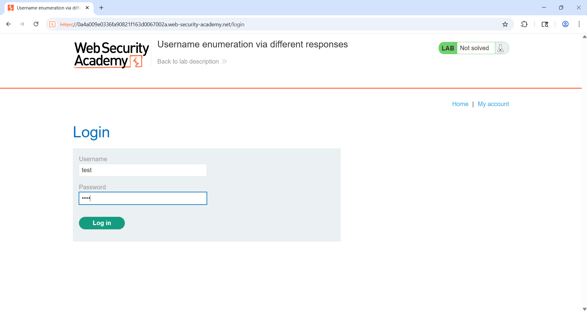

*Slika 3. Login stranica sa unesenim test parametrima*

d.  Zatim smo taj POST zahtev prosledili Burp Suite Intruder-u

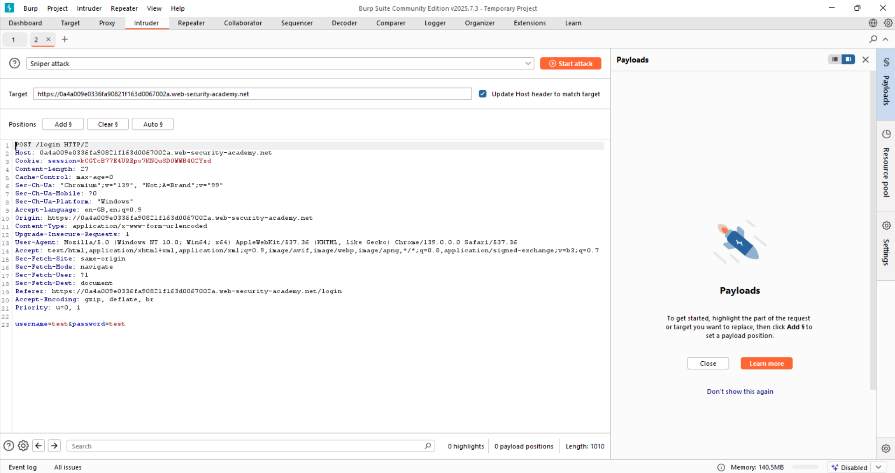

*Slika 4. Burp Suite Intruder sa prosleđenim zahtevom*

e.  Zatim smo kroz Intruder u parametar *username* postavili listu
    kandidata (lista *Candidate usernames* koju smo dobili uz zadatak)

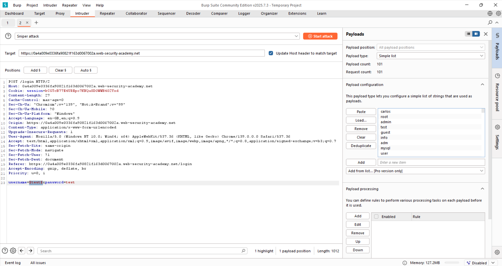

*Slika 5. Burp Suite Intruder sa prosleđenom listom kandidata za
korisničko ime*

f.  Zatim smo izvršili napad. U koloni ***Length*** smo uočili razliku i
    primetili smo da jedan od zahteva vraća drugačiji odgovor (poruka je
    "Invalid password" umesto "Invalid username")

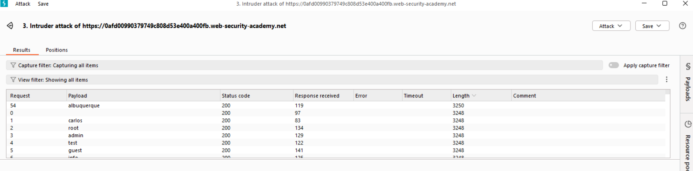

*Slika 6. Prikaz razlike u koloni Length*

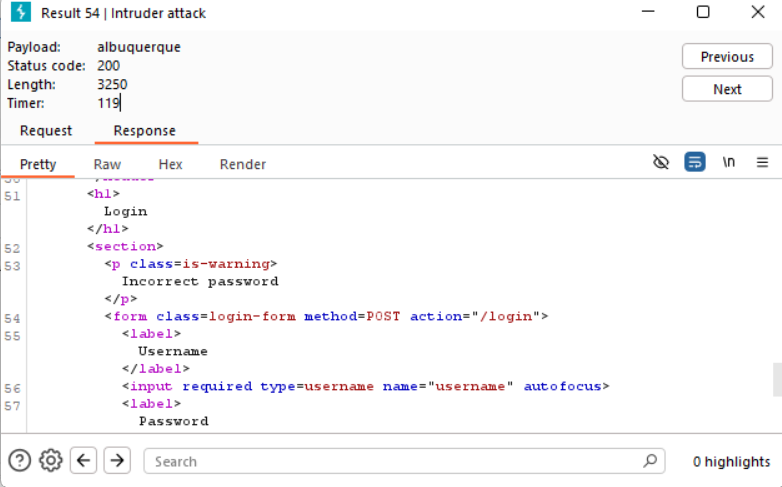

*Slika 7. Response za korisničko ime za koje je uočena razlika u koloni
Length*

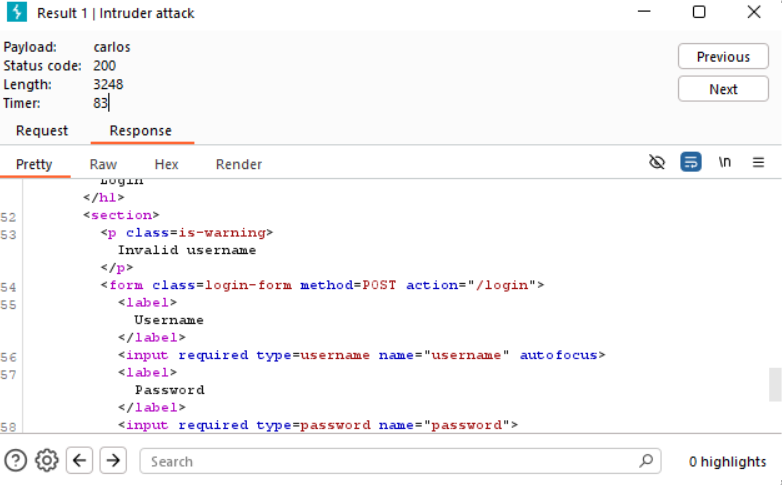

*Slika 8. Response za ostala korisnička imena*

g.  Na ovaj način smo identifikovali **validno korisničko ime.** U ovom
    slučaju je to bila vrednost **albuquerque**.

<!-- -->

2.  ***Password brute-force:***

    a.  Zatim smo ponovo presretali login zahteve, ovaj put koristeći
        validno korisničko ime koje smo dobili u prvom delu napada.

    b.  U intruder-u smo parametar *password* zamenili listom kandidata
        (lista "Candidate passwords" koju smo dobili uz zadatak).

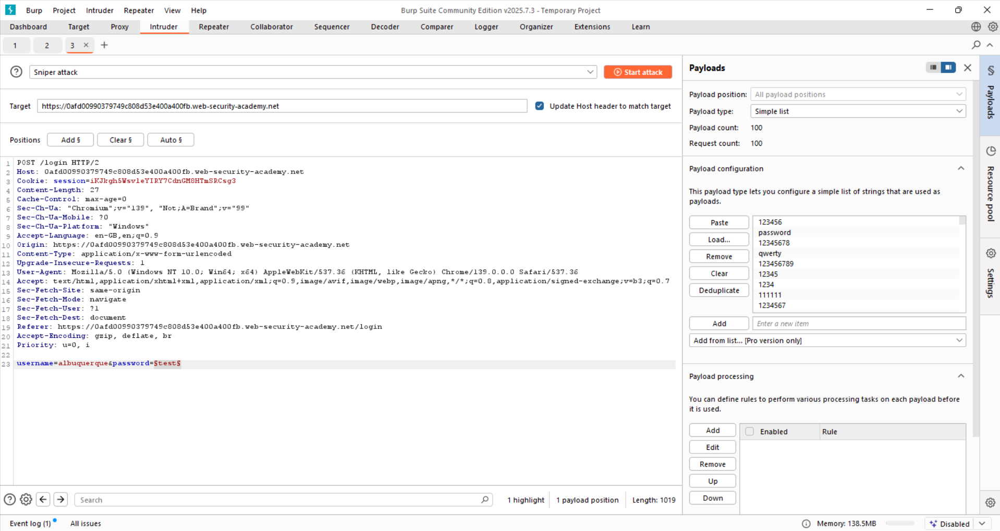

*Slika 9. Burp Suite Intruder sa prosleđenom listom kandidata za
lozinku*

c.  Nakon izvršenog napada, zaključili smo da je za jednu od vrednosti
    dobijen drugačiji rezultat. U ovom slučaju nismo posmatrali kolonu
    ***Length***, već kolonu ***Status code***. Za sve vrednosti osim za
    jednu od njih vraćen je statusni kod 200, dok je za jednu vrednost
    vraćen statusni kod 302. Na taj način smo zaključili koja je prava
    vrednost za lozinku. Kao što možemo videti, za pravu vrednost
    lozinke u response-u smo dobili *cookie*, a za ostale vrednosti
    poruku "Incorrect password".

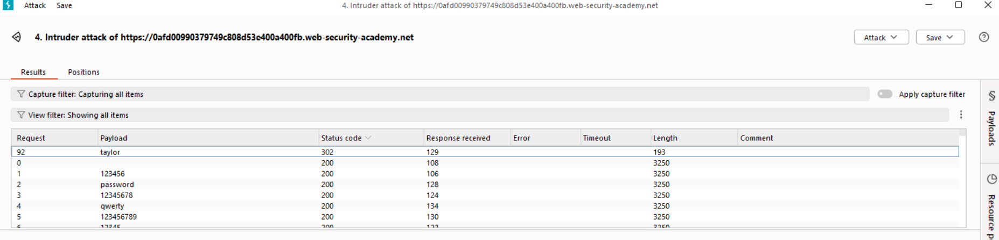

*Slika 10. Prikaz nekih rezultata testa sa označenom vrednošću koja se
razlikuje*

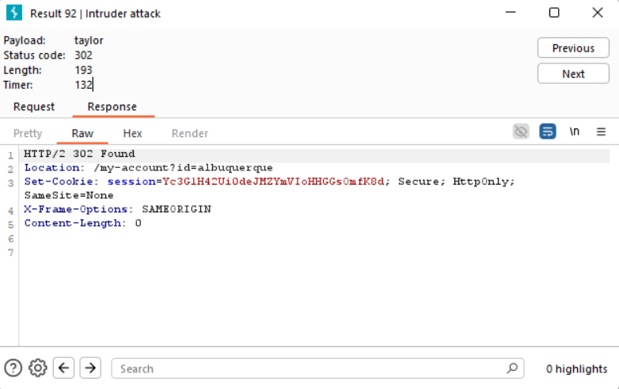

*Slika 11. Prikaz response-a kod koga smo dobili kod 302*

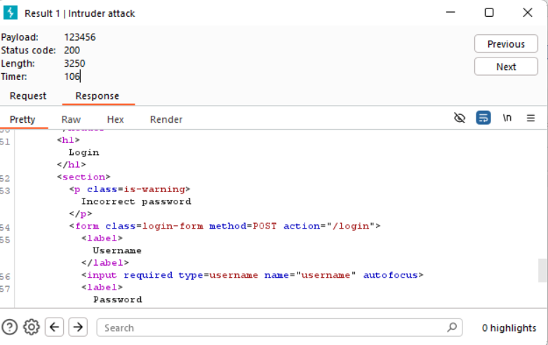

*Slika 12. Prikaz drugog response-a kod koga je dobijen kod 200*

Iz ovoga smo zaključili da je ispravna vrednost lozinke **taylor** i
sada možemo izvršiti prijavu na sistem.

## Lab: 2FA Simple Bypass

Ovaj zadatak demonstrira ranjivost u implementaciji dvofaktorske
autentifikacije (2FA). Dvofaktorska autentifikacija je sigurnosna mera
kojom korisnik, pored korisničkog imena i lozinke, mora uneti i dodatan
kod (obično poslat e-mailom, SMS-om ili generisan putem aplikacije).
Međutim, u ovoj implementaciji postojao je propust koji omogućava
potpuno zaobilaženje drugog faktora.

Zaobilaženje 2FA omogućava napadaču da, uz poznavanje korisničkog imena
i lozinke, direktno pristupi nalogu žrtve čak i bez verifikacionog koda.
Ovo kompromituje sigurnost naloga i poništava svrhu dvofaktorske
autentifikacije, otvarajući mogućnosti za krađu podataka, finansijske
prevare i druge oblike zloupotrebe.

### Opis rešenja:

1.  **Početna prijava:**

    a.  Prvo se prijavljujemo na sistem sa našim kredencijalima
        *wiener:peter*.

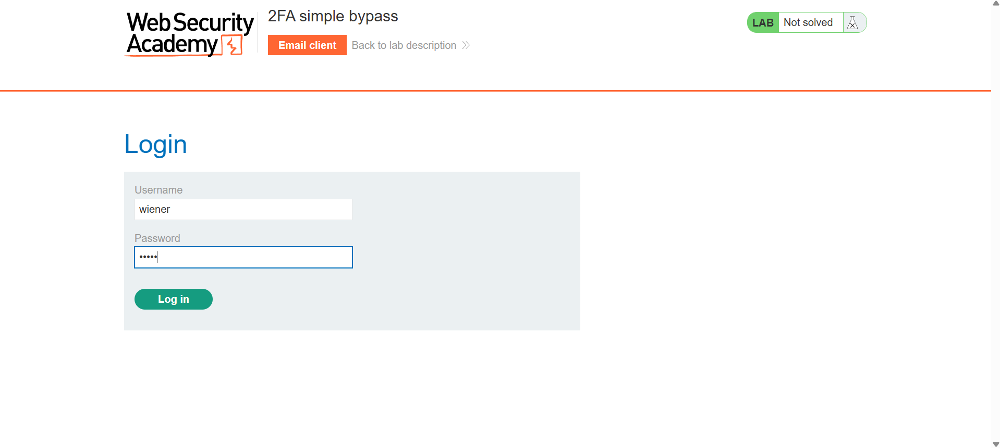

*Slika 13. Login stranica sa unetim našim kredencijalima*

b.  Nakon što su kredencijali prihvaćeni, sistem nas prebacuje na
    stranicu za unos koda za dvofaktorsku autentifikaciju.

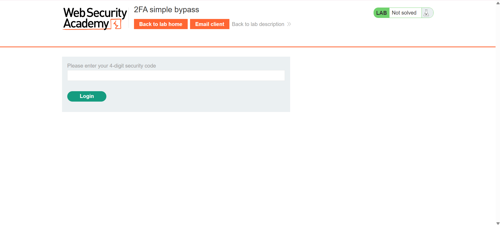

*Slika 14. Prikaz stranice za unos koda za 2FA*

c.  Onda odlazimo u naš email inbox kako bismo videli naš kod za 2FA.

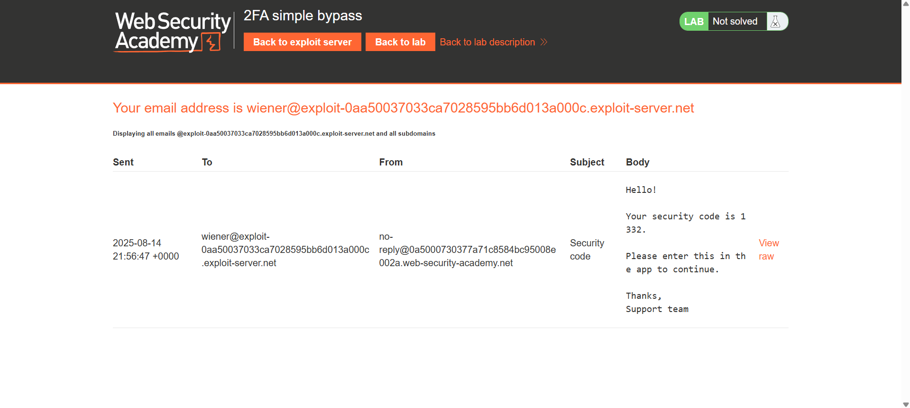

*Slika 15. Prikaz e-mail inbox-a*

d.  Nakon toga, prijava na sistem je uspešno završena i mi zapažamo URL
    koji smo dobili.

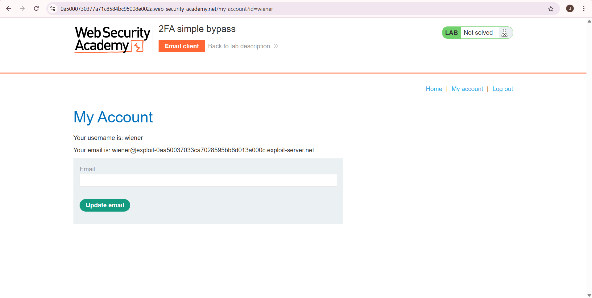

*Slika 16. Stranica našeg profila nakon uspešne prijave*

2.  ***Bypass 2FA:***

    a.  Nakon toga, odjavljujemo se sa našeg naloga i prijavljujemo se
        koristeći kredencijale žrtve, *carlos:montoya*.

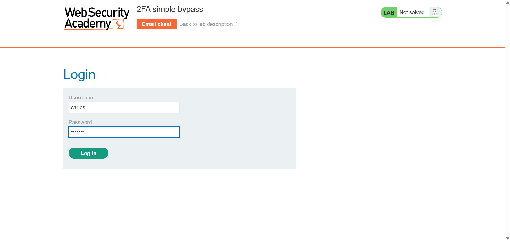

*Slika 17. Login stranica sa unetim kredencijalima žrtve*

b.  Nakon što su kredencijali prihvaćeni, sistem nas prebacuje na
    stranicu za unos koda za dvofaktorsku autentifikaciju, ali mi ga
    nemamo jer nemamo pristup žrtvinom sandučetu elektronske pošte.

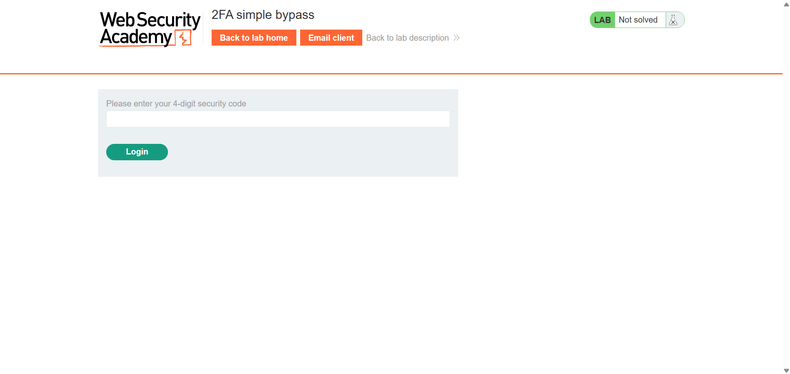

*Slika 17. Prikaz stranice za unos koda za 2FA žrtve*

3.  Zatim ručno menjamo URL tako da vodi na */my-account* i to nam
    prikazuje da smo se uspešno prijavili na sistem kao žrtva, što nije
    dobro.

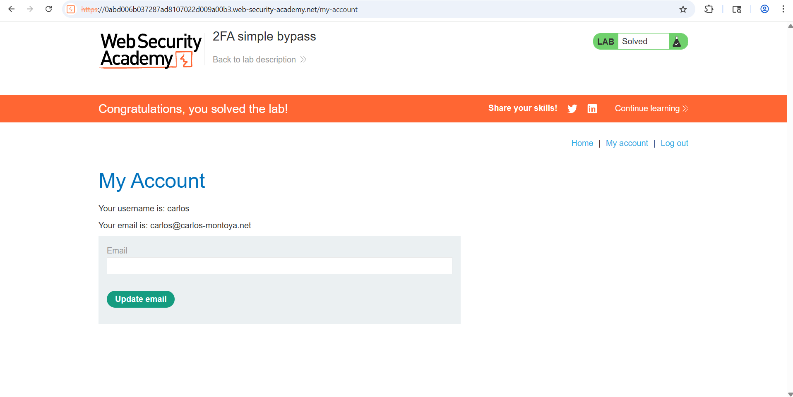

*Slika 18. Prikaz profila žrtve*

## Lab: Password reset broken logic

Ovaj zadatak demonstrira ranjivost u funkcionalnosti resetovanja
lozinke, koja omogućava napadaču da preusmeri reset link na svoju
kontrolisanu lokaciju i zatim resetuje lozinku žrtve.

Ova vrsta ranjivosti omogućava napadaču da preuzme kontrolu nad bilo
kojim nalogom bez poznavanja trenutne lozinke. Može dovesti do potpunog
kompromitovanja korisničkih podataka, zloupotrebe naloga, pa čak i
potpunog preuzimanja administratorskih privilegija.

### Opis napada i koraci rešenja:

1.  Sa stranice za prijavu na sistem klikom na link *Forgot password?*
    prelazimo na stranicu za reset lozinke i tu unosimo naše korisničko
    ime.

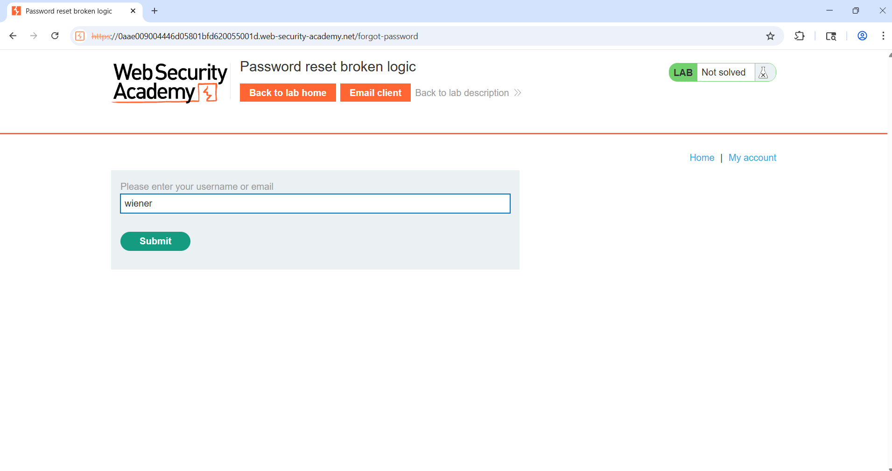

*Slika 19. Prikaz stranice za reset lozinke*

2.  Nakon što unesemo korisničko ime, sistem nas navodi da odemo u naš
    email inbox kako bismo iskoristili link za reset lozinke.

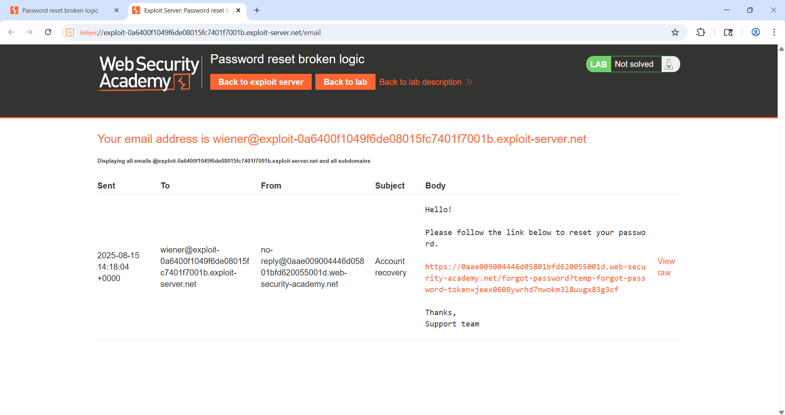

*Slika 20. Prikaz e-mail inbox-a*

3.  Zatim kliknemo na link u e-mail poruci i on nas vodi na stranicu za
    unos i potvrdu nove lozinke. Tu unosimo novu vrednost za lozinku.

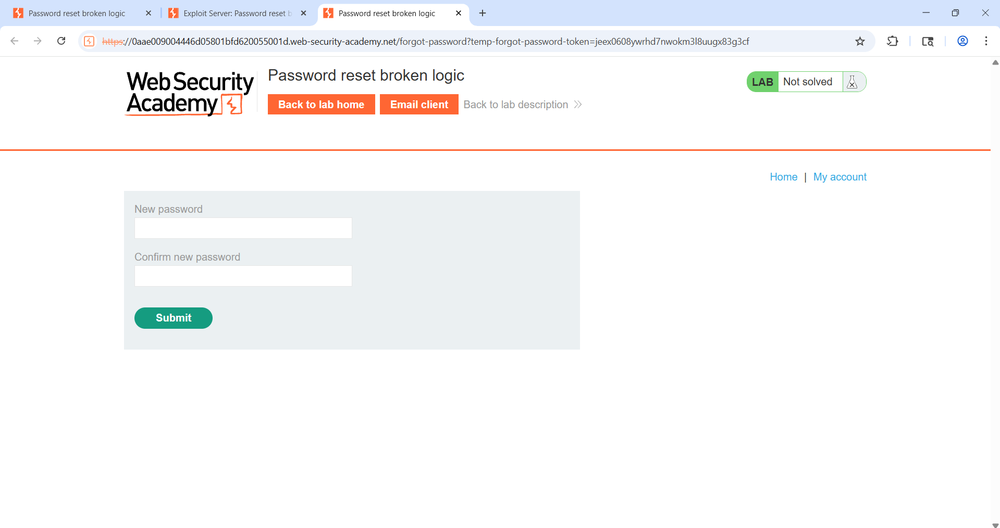

*Slika 21. Stranica za unos i potvrdu nove lozinke*

4.  U Proxy tab-u Burp Suite-a otvaramo HTTP history i pronalazimo POST
    zahtev upućen na link */forgot-password?temp-forgot-password-token*
    i taj zahtev šaljemo u Burp Repeater.

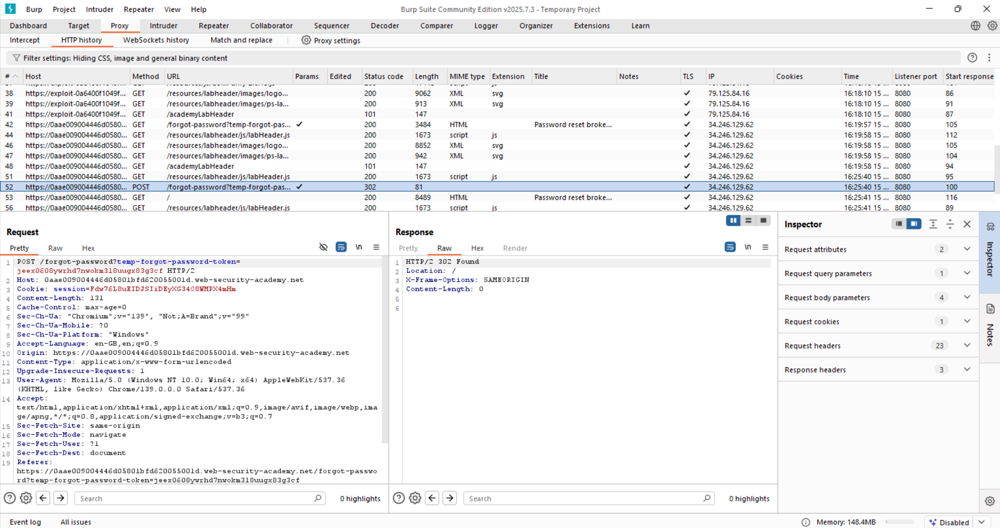

*Slika 21. Prikaz označenog zahteva u Burp HTTP history*

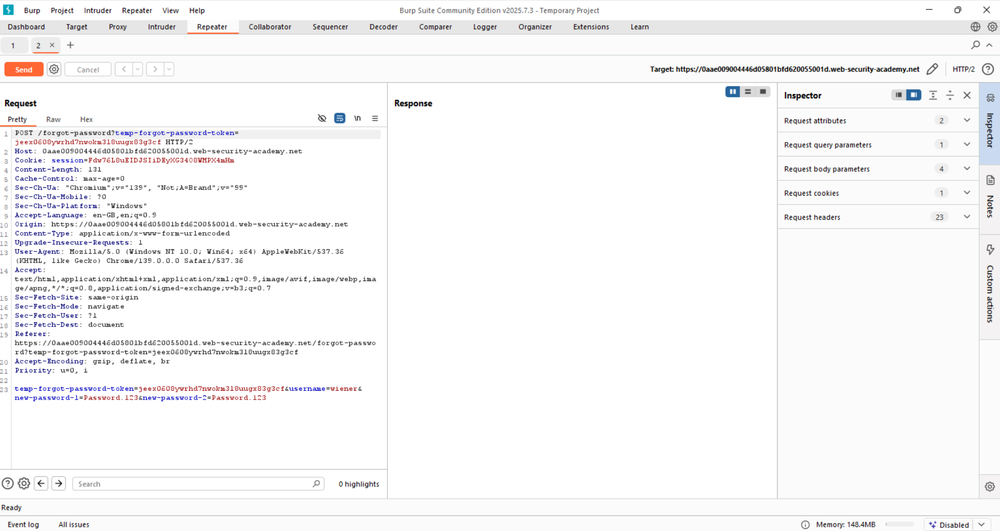

*Slika 22. Prikaz zahteva u Burp Suite Repeater-u*

5.  U sledećem koraku, u okviru Burp Suite Repeater-a, menjamo vrednosti
    za *temp-forgot-password-token* na oba mesta na kojima se pojavljuje
    i onda menjamo korisničko ime u zahtevu u korisničko ime žrtve
    (*carlos* u ovom slučaju) i šaljemo tako izmenjen zahtev pritiskom
    na dugme *Send*. dobijamo statusni kod 302, što je dobro.

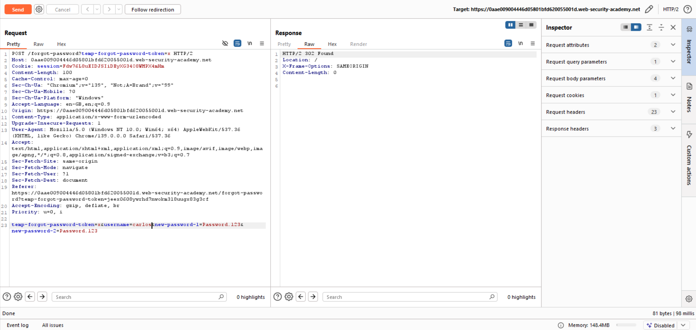

*Slika 23. Prikaz nakon slanja zahteva*

6.  Zatim kliknemo na dugme *Follow redirection* i to nas odvodi na
    početnu stranicu aplikacije.

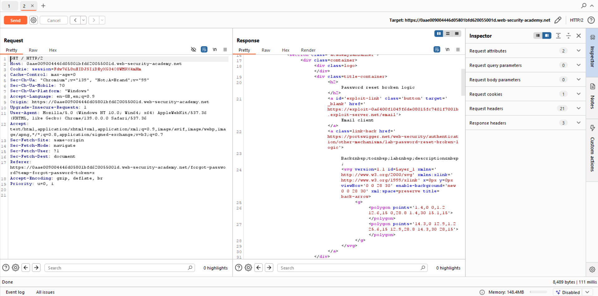

*Slika 24. Prikaz zahteva nakon redirekcije*

7.  Zatim pokušavamo da odemo na *My Account*, da bismo proverili da li
    radi i pokušavamo da se prijavimo na sistem koristeći kredencijale
    žrtve, u ovom slučaju *carlos:Password.123*. Lozinku smo uspeli da
    promenimo u prethodnom zahtevu.

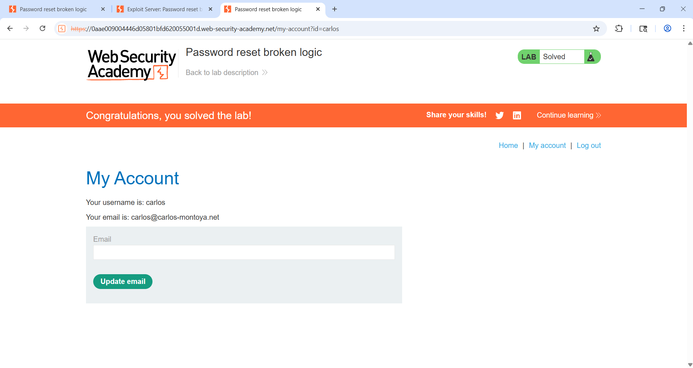

*Slika 24. Prikaz stranice nakon prijave kredencijalima žrtve*

8.  Prijava je uspešno izvršena i time je ovaj zadatak rešen.

## Lab: Username enumeration via subtly different responses

Ovaj zadatak demonstrira kako i male, suptilne razlike u odgovorima
servera mogu biti iskorišćene za otkrivanje validnih korisničkih imena,
a zatim i za brute-force napad na lozinku.

### Opis napada i koraci rešenja:

Kao i u prvom zadatku, prvo pokušavamo da se prijavimo nekim
kredencijalima, npr. *Test:test*. To prijavljivanje će biti neuspešno.
Mi iz HTTP history šaljemo zahtev u Burp Suite Intruder. Zatim
označavamo vrednost korisničkog imena i učitavamo listu kandidata za
korisničko ime. U podešavanjima Burp Suite Intrudera smo označili da nam
prati poruku o greški *Invalid username or password.* Uz pomoć opcije
Grep -- Extract i pokrećemo napad.

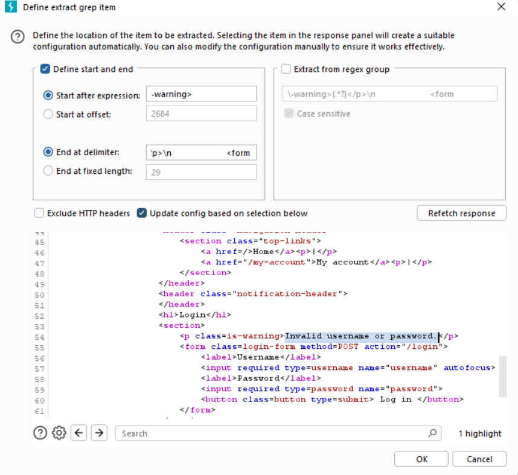

*Slika 25. Podešavanja za grep -- extract*

Sada primećujemo da u rezultatima testiranja imamo jednu dodatnu kolonu
koja nam pomaže da pratimo razlike u poruci o greški koju smo ranije
označili. Jedan od rezultata se razlikuje po tome što uemsto tačke na
kraju nemamo ništa i zaključujemo da je to traženo korisničko ime. U
ovom slučaju je to vrednost **al**.

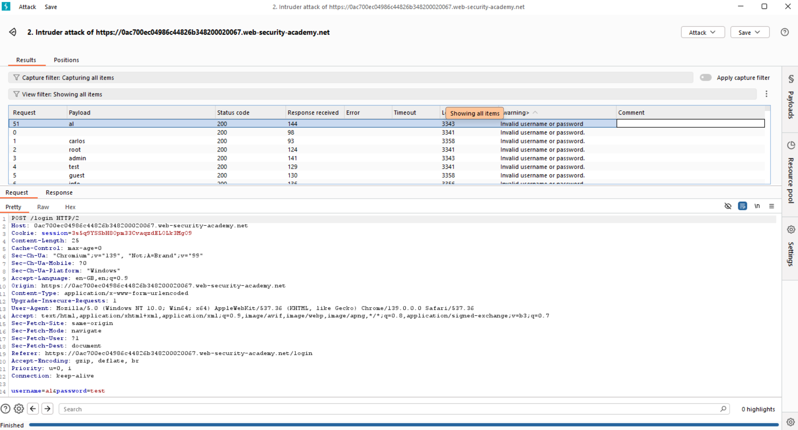

*Slika 26. Prikaz rezultata testa*

Sada menjamo vrednost korisničkog imena na ono koje smo u prethodnom
koraku otkrili, učitavamo dobijenu listu kandidata za lozinku i ponovo
pokrećemo test. Nakon tog napada, zaključujemo da za sve zahteve osim
jednog dobijamo statusni kod 200 i odgovor *Invalid username or
password*, a za jedan test dobijamo statusni kod 302 bez ikakve poruke i
pretpostavljamo da je to vrednost lozinke. U našem slučaju je to
vrednost **dallas**.

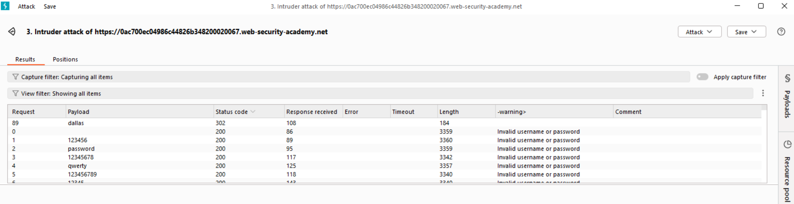

*Slika 27. Rezultati testa za vrednost lozinke*

Sada pokušavamo da se prijavimo na sistem dobijenim kredencijalima.
Prijavljivanje je izvršeno, dobili smo pristup nalogu žrtve sa
kredencijalima al:dallas i ovim je zadatak uspešno rešen.

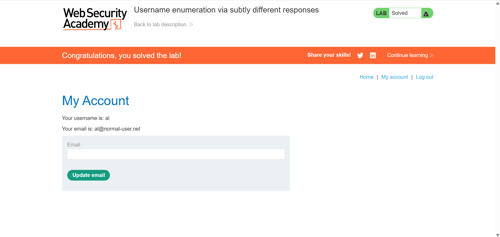

*Slika 28. Prikaz profila žrtve*

## Lab: Username Enumeration via Response Timing

Ovaj zadatak demonstrira ranjivost gde se validnost korisničkog imena
može otkriti merenjem vremena odgovora servera. Kada se kombinuje sa
brute-force napadom na lozinku, napadač može kompromitovati korisnički
nalog.

Ova ranjivost omogućava otkrivanje validnih korisničkih imena čak i bez
direktnih poruka o grešci. Kada napadač pronađe validno korisničko ime,
brute-force na lozinku postaje mnogo lakši, što dovodi do
kompromitovanja naloga i potencijalnog pristupa ovim podacima.

### Opis napada i koraci rešenja:

Prvo se prijavimo na sistem koristeći neke nasumične kredencijale za
koje smo sigurni da prijavljivanje neće raditi (npr. test:test).

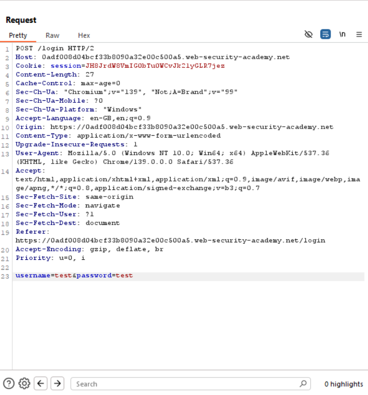

*Slika 29. Prikaz zahteva*

Zatim pokušavamo više puta da se prijavimo na sistem, svaki put sa
drugačijim kredencijalima. Posle nekoliko pokušaja, naša IP adresa je
blokirana zbog previše neuspešnih pokušaja na sistem.

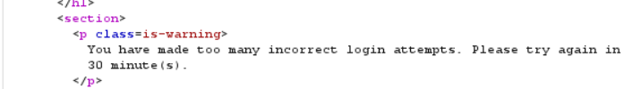

U zahtev dodajemo zaglavle X-Forwarded-For i postavljamo na neku
nasumičnu vrednost, npr. 1 i pošaljemo zahtev iz Repeater-a. Ovim ćemo
zaobići blokadu IP adrese i poslati zahtev.

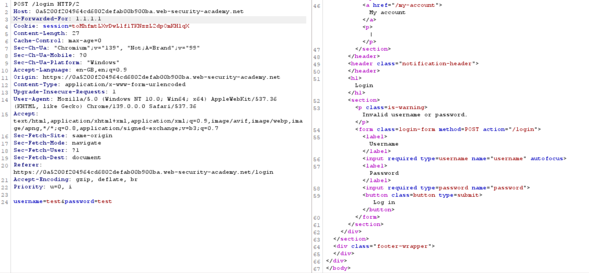

*Slika 31. Prikaz zahteva sa dodatim X-Forwarded-For zaglavljem*

Zatim šaljemo ovaj zahtev u Intruder. Uzimamo listu kandidata za
korisničko ime koju smo dobili uz zadatak, a za lozinku postavljamo jako
dugačak string (npr. String od 100 karaktera 'a'). Kao prvu poziciju
vrednost X-Forwarded-For, a za drugu postavljamo vrednost lozinke i
pokrećemo Pitchfork attack.

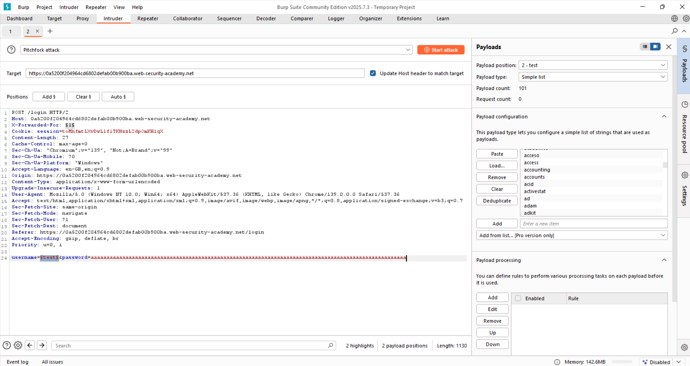

*Slika 32. Intruder podešen za Pitchfork attack*

Nakon izvršenog Pitchford attack-a, primećujemo da je za jednu od
vrednosti korisničkog imena kolona Response received znatno veća nego
kod ostalih. U ovom slučaju je to vrednost *oracle*, pa pretpostavljamo
da je to korisničko ime koje tražimo.

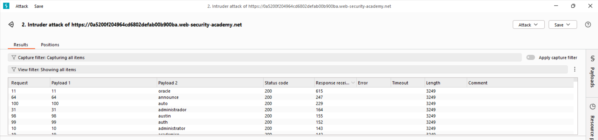

*Slika 33. Prikaz testa za korisničko ime*

Nakon što smo dobili ove rezultate, menjamo vrednost korisničkog imena u
zahtevu na vrednost oracle. Da bismo otkrili vrednost lozinke, ponovo
pokrećemo pitchfork attack. Za prvu poziciju postavljamo vrednost
X-Forwarded-For, a za drugu vrednost lozinke u zahtevu. Za vrednost
X-Forwarded-For postavljamo sekvencu brojeva od 1 do 100, sa korakom 1,
a za vrednost lozinke koristimo listu kandidata dobijenu za zadatak.
Sada primećujemo da smo za jednu od vrednosti lozinke kao odgovor dobili
statusni kod 302 (dok je za ostale statusni kod bio 200). Response
received za tu vrednost je takođe dosta manji nego za druge vrednosti.
Takođe, kolona Length ima dosta manju vrednost za tu vrednost lozinke. U
ovom slučaju, ta vrednost lozinke je *matrix* i pretpostavljamo da je to
naša tražena vrednost lozinke.

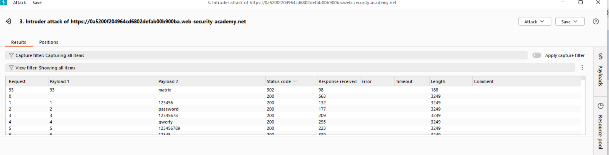

*Slika 34. Prikaz rezultata testa za vrednost lozinke*

Kao poslednji korak, pokušavamo da se prijavimo parom kredencijala koji
smo dobili kroz testove, a to je *oracle:matrix*. Prijava je uspešno
izvršena i time je ovaj zadatak uspešno rešen.

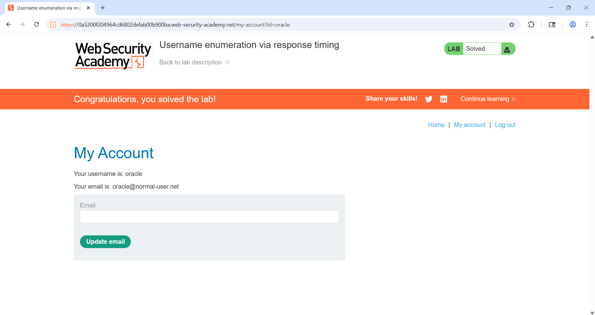

*Slika 35. Prikaz naloga korisnika nakon uspešne prijave*

## Lab: Broken brute-force protection, IP block

Cilj ovog zadatka je iskoristiti logičku grešku u IP-based zaštiti kako
bismo brute-force-ovali lozinku korisnika sa korisničkim imenom *carlos*
i pristupili njegovom nalogu.

Prvo pokušavamo da se prijavimo na sistem nekim nasumičnim parom
kredencijala. Naravno, ovo neće raditi i dobićemo poruku o greški. U
prethodnom zadatku smo uočili da će nas sistem posle 3 neuspešna
pokušaja prijave blokirati na 30 minuta. Blokada se aktivira po IP-ju,
ne po korisničkom nalogu. Moguće je resetovati brojač neuspelih pokušaja
tako što ćemo se posle drugog pokušaja prijaviti pravilnim
kredencijalima, npr. U u ovom slučaju su tu kredencijali *wiener:peter*.
Nakon jednog neuspešnog pokušaja prijave, pronalazimo taj zahtev u HTTP
history i šaljemo ga u Intruder. U Intruderu podešavamo sve što je
neophodno za *Pitchfork attack*. Ali, ovde postoji nekoliko razlika u
podešavanjima. Ovde ćemo iskoristiti podešavanja *resource pool*-a kako
bismo ograničili broj zahteva koji se šalje u jednom trenutku na jedan.
Ovo će nam omogućiti da će se zahtevi slati u pravilnom redosledu.

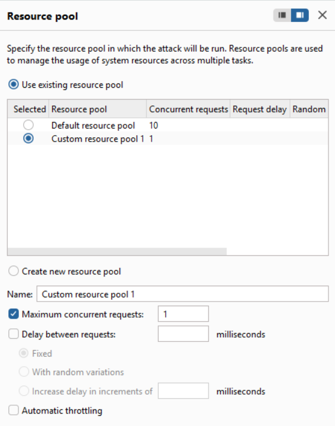

*Slika 36. Prikaz podešavanja za resource pool*

Kao pozicije za ovaj napad postavljamo vrednosti *username* i
*password*. Kao vrednosti za *username* koristimo listu u kojoj su
naizmenično postavljeni naše korisničko ime (wiener) i korisničko ime
žrtve (carlos). Vodimo računa o tome da se vrednost *carlos* pojavljuje
minimalno 100 pita jer u listi *Candidate password* imamo 100 kandidata
za vrednost lozinke.

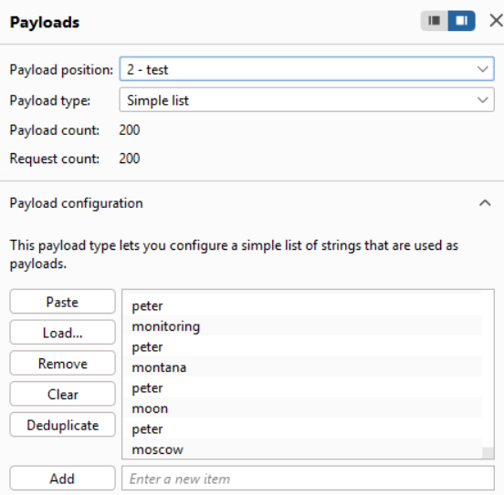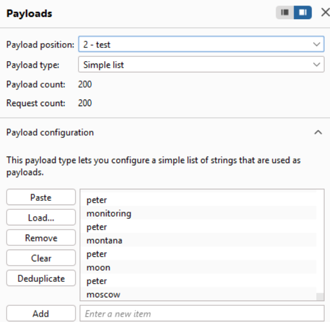

*Slika 37. Podešavanja za username Slika 38. Podešavanja za password*

Nakon izvršenog napada, primećujemo da samo za jednu vrednost lozinke
gde je vrednost korisničkog imena dobijamo statusni kod 302, dok za
ostale parove kredencijala dobijamo statusni kod 200. Zaključujemo da su
ti kredencijali za koje dobijamo 302 oni koje tražimo jer kada se
prijavljujemo kredencijalima wiener:peter koji su ispravni, takođe
dobijamo statusni kod 302. U našem slučaju ta vrednost lozinke je
*princess*.

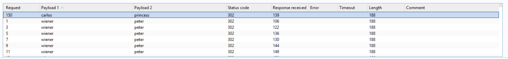

*Slika 39. Prikaz rezultata napada*

Kao poslednji korak rešavanja ovog zadatka, pokušavamo da se prijavimo
na sistem kredencijalima *carlos:princess*. Prijavljivanje na sistem je
izvršeno i time je ovaj zadatak uspešno rešen.

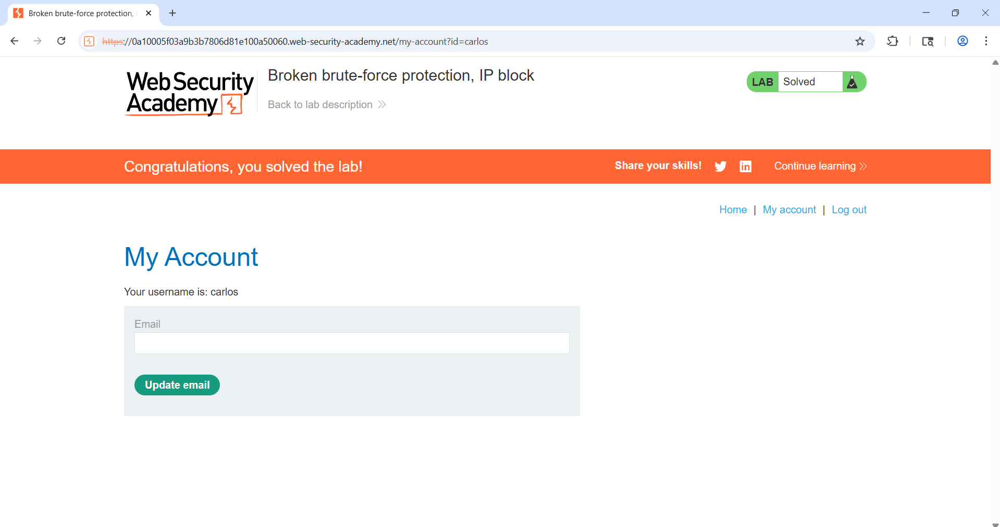

*Slika 40. Prikaz naloga žrtve nakon prijave na sistem*

# XSS (Cross-site scripting) klasa napada

***Cross-site scripting (XSS)*** je vrsta napada koja spada u grupu
**injekcionih napada**. Napadač ubacuje (injektuje) **maliciozni
JavaScript kod** u web aplikaciju koja ne filtrira ili ne validira
korisnički unos ispravno.

Taj kod se zatim izvršava u pregledaču (browseru) drugih korisnika koji
pristupe aplikaciji, kao da potiče od legitimnog izvora.

Postoje tri glavne vrste XSS-a:

- ***Stored (persistent)*** -- maliciozni kod se trajno čuva u bazi
  podataka ili na serveru (npr. U komentarima, objavama na forumima)

- ***Reflected (non-persistent)*** -- maliciozni kod se šalje kroz URL
  ili formu i reflektuje nazad ka korisniku odmah (npr. Kroz parametre
  pretrage)

- ***DOM-based*** -- manipulacija DOM-a u pregledaču gde se maliciozni
  sadržaj nikad ne šalje serveru, već nastaje u klijentskom JavaScript
  kodu.

Posledice uspešnog XSS napada mogu biti veoma ozbiljne:

- **Krađa kolačića i sesijskih tokena** → napadač može preuzeti
  korisnički nalog.

- **Lažiranje korisničkih akcija** (npr. Klikovi, slanje formulara,
  promene lozinki).

- **Krađa osetljivih podataka** (*form input*, lični podaci, brojevi
  kartica).

- ***Phishing i social engineering*** → ubacivanje lažnih formi za unos
  podataka.

- **Širenje *malware*-a** kroz inficirane stranice.

- ***Defacement*** → izmena izgleda sajta ili umetanje uvredljivih ili
  obmanjujućih poruka.

- U najgorim slučajevima, **kompromitovanje celog sistema korisničkih
  naloga** i reputacije aplikacije.

XSS uspeva kada softver ima sledeće slabosti:

- **Nedostatak validacije ulaza** -- aplikacija prihvata korisnički unos
  (npr. *\<script\>*) bez ikakve kontrole.

- **Nedostatak enkodiranja izlaza** -- podaci se upisuju direktno u HTML
  ili JavaScript bez escape-ovanja.

- **Nedostatak *Content Security Policy (CSP)*** -- aplikacija nema
  dodatne mehanizme zaštite od ubacivanja skripti.

- **Nedostatak filtriranja parametara u URL-u i DOM manipulacijama**.

- **Slaba izolacija podataka korisnika** -- kada se podaci više
  korisnika prikazuju bez kontrole u zajedničkom interfejsu (npr.
  Komentari, čet).

Da bi se sprečili XSS napadi, potrebno je kombinovati više mera:

1.  **Validacija i sanitizacija ulaza**

    a.  Odbaciti ili filtrirati sve neočekivane znakove (\<, \>, ', ",
        &, /) u korisničkom unosu.

    b.  Koristiti biblioteke za sanitizaciju (npr. *DOMPurify*).

2.  **Enkodiranje izlaza (*output encoding*)**

    a.  Pre nego što se korisnički unos prikaže u HTML-u, JavaScript,
        CSS ili URL, mora se enkodirati prema kontekstu.

    b.  Primer: *\<script\>alert('XSS')\</script\>* se enkodira i
        prikaže kao običan tekst umesto kao izvršni kod.

3.  **Korišćenje sigurnih HTTP zaglavlja**

    a.  *Content-Security-Policy (CSP)* -- ograničava izvore skripti i
        sprečava izvršavanje *inline* JavaScript-a.

    b.  *HttpOnly* flag za kolačiće -- onemogućava pristup kolačićima
        kroz JavaScript.

    c.  *Secure* flag za kolačiće -- obezbeđuje da se kolačići šalju
        samo preko HTTPS-a.

4.  **Izbegavanje *eval()* i sličnih funkcija** u JavaScript kodu -- jer
    omogućavaju dinamičko izvršavanje unetog sadržaja.

5.  **Sigurnosni testovi i analize koda**

    a.  Redovan ***penetration testing*** i korišćenje alata za
        automatsku detekciju XSS ranjivosti.

    b.  *Code review* i statička analiza koda.

6.  ***Least privilege* i izolacija**

    a.  Ograničiti šta korisnički unosi mogu da urade u aplikaciji.

    b.  Izolovati korisnički sadržaj u *sandbox iframe*-ovima kada god
        je to moguće.

## Lab: Reflected XSS into HTML context with nothing encoded

Ovaj zadatak sadrži reflektovanu XSS ranjivost u funkcionalnosti
pretrage. Korisnički unos nije enkodiran i direktno se ubacuje u HTML,
što omogućava napadaču da ubaci maliciozni JavaScript kod. Cilj je
izvršiti XSS napad tako da se pozove JavaScript funkcija *alert()*.

Kada se u polje za pretragu unese neka vrednost (npr. *test*),
aplikacija učita novu stranicu i u HTML kodu reflektuje taj unos.

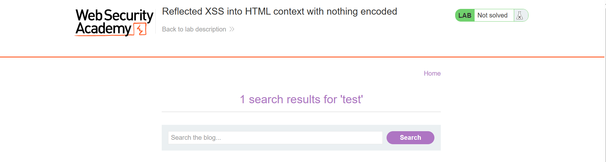

*Slika 1. Prikaz stranice nakon pretrage reči 'test'*

Pregledom HTML koda vidi se da se vrednost parametra ***search***
ubacuje direktno u HTML bez ikakvog enkodiranja ili validacije.

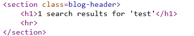

*Slika 2. Prikaz izmenjenog HTML koda nakon izvršene pretrage*

Pošto ništa nije enkodirano, možemo direktno ubaciti HTML ili JavaScript
tagove. Najjednostavniji način da to uradimo je da u polje za pretragu
unesemo *\<script\>alert(1)\</script\>*. Kada to uradimo, pojaviće se
JavaScript alert sa sadržajem koji smo uneli u polje za pretragu i time
je ovaj zadatak rešen.

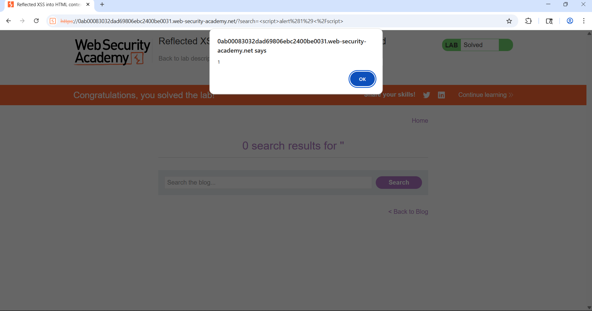

*Slika 3. Prikaz stranice nakon izvršenog koda*

## Lab: Stored XSS into HTML context with nothing encoded

Ovaj zadatak poseduje ***stored (persistent) XSS*** ranjivost u
funkcionalnosti komentarisanja na blog postu. Za razliku od
reflektovanog XSS-a, kod *stored* varijante maliciozni kod se **čuva na
serveru** (npr. U bazi) i izvršava se svaki put kada korisnici otvore
stranicu na kojoj je zaraženi sadržaj. Cilj je ubaciti komentar koji
sadrži maliciozni JavaScript (*alert()*) i time dokazati da se ranjivost
može iskoristiti.

Kao prvi korak u rešavanju zadatka, otvaramo jedan od blog postova i
pronalazimo sekciju sa komentarima, zatim probamo da ostavimo komentar i
vidimo da nema nikakve provere ni enkodiranja i da se komentar odmah
pojavljuje na stranici. To ostavlja prostor za unos koda u
*\<script\>\</script\>* tagovima koji će se izvršavati svaki put kada
neko od korisnika otvori ovu stranicu.

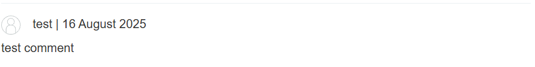

*Slika 4. Prikaz test komentara koji smo uneli*

Najlakši način da rešimo ovaj zadatak je da u polje za unos komentara
unesemo kod unutar \<script\> taga koji će otvoriti alert sa unetom
vrednošću, npr. *\<script\>alert(1)\</script\>*. Kada se pojavi *alert*,
zadatak je uspešno rešen.

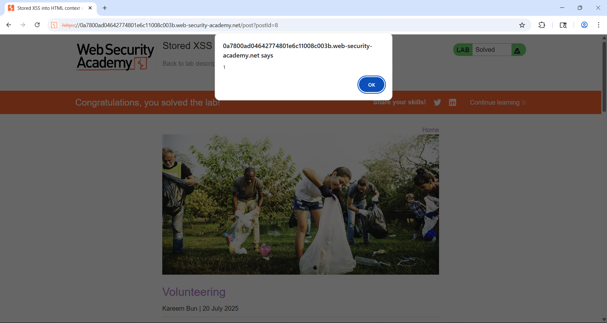

*Slika 5. Prikaz stranice nakon izvršenog koda iz komentara*

## Lab: DOM XSS in document.write sink using source location.search inside a select element

Ovaj zadatak poseduje ***DOM-based XSS* ranjivost** u funkcionalnosti
*stock checker*. JavaScript kod uzima podatke direktno iz
*location.search* (tj. *Query* parametara iz URL-a) i prosleđuje ih
funkciji *document.write*. Taj sadržaj se ubacuje unutar *\<select\>*
elementa. Naš cilj je da **prekinemo** *\<select\>* **kontekst** i
ubacimo maliciozni JavaScript kod koji poziva *alert()*.

Kada otvorimo funkcionalnost za proveru stanja zaliha, URL izgleda
ovako: */product?productId=1*. Parametar *storeId* se koristi u
JavaScript-u i preko *document.write* funkcije ispisuje unutar
*\<select\>* taga. Pošto ništa nije enkdorano, možemo manipulisati
vrednošću *storeId* i ubaciti svoj HTML ili JavaScript kod.

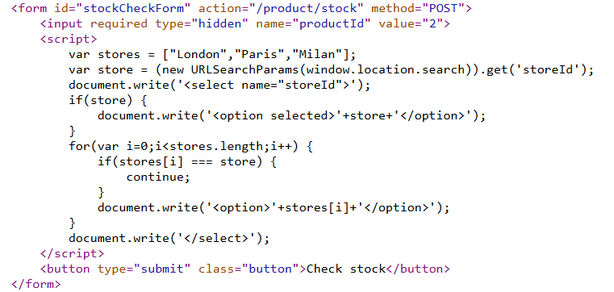

*Slika 6. Deo koda koji nam je od interesa*

Ovu ranjivost možemo iskoristiti tako što izmenimo URL tako što dodamo
kod unutar script tagova koji otvara alert()*.* Ovo radimo tako što na
kraju URL-a dodamo *storeId=*\</select\>*\<script\>alert(1)\</script\>*.
Ovo će izazvati pojavu alert-a i ovim je zadatak uspešno rešen.

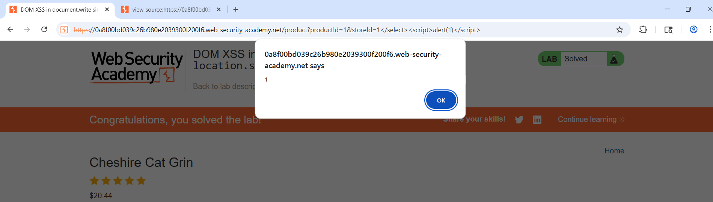

*Slika 6. Prikaz stranice sa alert-om*

## Lab: DOM XSS in AngularJS expression with angle brackets and double quotes HTML-encoded

Ovaj zadatak sadrži ***DOM-based XSS* ranjivost** u funkcionalnosti za
pretragu, implementiranoj pomoću **AngularJS-a**. AngularJS omogućava
izvršavanje JavaScript izraza unutar dvostrukih vitičastih zagrada *{{
... }}* kada je na stranici pristuan *ng-app* atribut. Ovde je
specifično što su uglaste zagrade *\< \>* i navodnici " "
**HTML-enkodirani**, pa ne možemo direktno koristiti *\<script\>*
tagove. Cilj zadatka je da iskoristimo AngularJS izraze kako bismo
izvršili *alert()* funkciju.

Kada unesemo nešto u polje za pretragu, vrednost se reflektuje u HTML
unutar AngularJS konteksta. AngularJS će pokušati da interpretira sve
izraze u *{{ }}*. Pošto \<, \> i " ne prolaze, rešenje je da iskoristimo
***AngularJS expression injection*** preko *{{ ... }}*.

Najjednostavniji način da ovo uradimo je da u polje za pretragu unesemo
*{{\$eval.constructor(\'alert(1)\')()}}* i kliknemo ***search***. Kada
se rezultat pretrage prikaže, AngularJS interpretira izraz i izvršava
*alert(1)*. Kada ovo uradim, trebao bi da se pojavi *alert box* i time
će ovaj zadatak biti uspešno rešen.

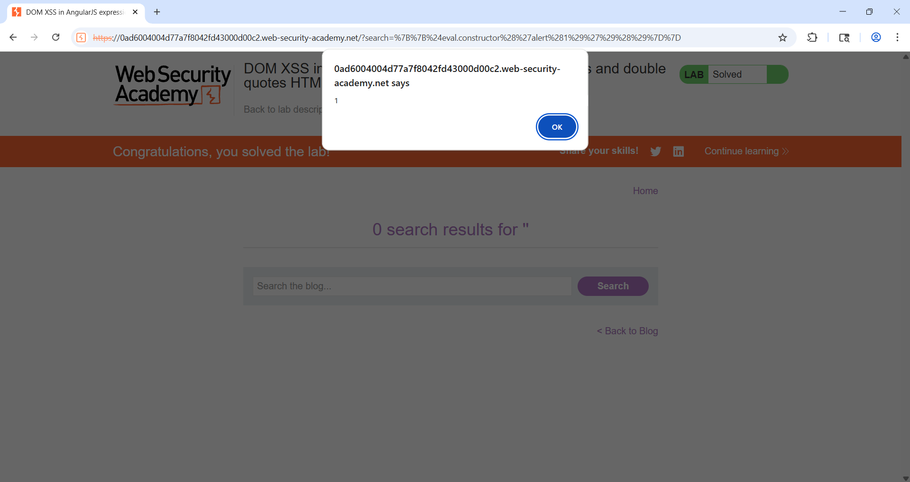

*Slika 7. Prikaz stranice sa alert-om*

## Lab: Reflected DOM XSS

Ovaj zadatak pokazuje ***reflected DOM XSS*** ranjivost. Za razliku od
klasičnog *server-side XSS*-a, ovde podaci koje pošaljemo ne prolaze
kroz serversku logiku direktno u HTML, već se ubacuju u **JavaScript
kod** koji na klijentu manipuliše DOM-om.

Otvorimo lab i uočimo da postoji polje za pretragu. Kada unesemo nešto
(npr. test), URL postane:

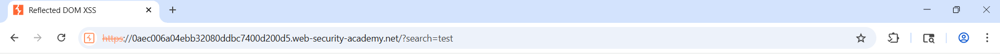

*Slika 8. Prikaz URL-a nakon izvršene pretrage*

Tokom testiranja funkcionalnosti pretrage na sajtu, primećujemo da se
korisnički unos vraća u odgovoru, ali ne direktno u HTML, već kao deo
JSON objekta. Na prvi pogled, unos se nalazi unutar atributa
"searchTerm". Daljim pogledom aplikacije (koristeći Burp Suite za
presretanje saobraćaja), ispostavilo se da JavaScript fajl
[[searchResults.js]{.underline}](http://searchresults.js) preuzima ovaj
JSON i prosleđuje ga eval() funkciji. Ovo je veoma opasno, jer svaki
nefiltrirani unos može rezultovati izvršavanjem proizvoljnog koda u
pretraživaču korisnika.

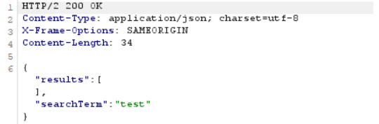

*Slika 9. Prikaz response-a na zahtev za pretragu*

Testiranjem različitih vrednosti u polju za pretragu, došli smo do
sledećeg zaključka:

- Aplikacija pravilno enkodira dvostruke navodnike (")

- Međutim, karakter \\ (*backslash*) se **ne** **enkodira**.

Ovo znači da možemo manipulisati načinom na koji se JSON parsira tako
što ćemo iskoristiti *backslash* da "pobegnemo" iz stringa.

Nakon testiranja, zaključili smo da payload koji uspeno iskorišćava
ranjivost glasi: \\"-alert(1)}//. Ovo radi na sledeči način:

1.  Sekvenca \\" obmanjuje aplikaciju da generiše dodatni *backslash* u
    odgovoru. Ovo neutralizuje *escaping* i omogućava zatvaranje
    stringa.

2.  Znak - (minus operator) razdvaja string od naredne JavaScript
    funkcije.

3.  Poziv *alert(1)* se izvršava jer deo JavaScript izraza koji *eval()*
    obrađuje.

4.  Znakovi *}}//* zatvaraju JSON strukturu i komentarišu ostatak,
    sprečavajući sintaksne greške.

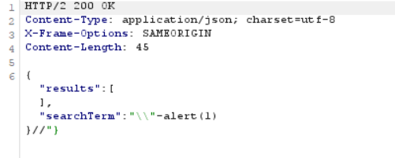

*Slika 10. Prikaz vrednosti polja za pretragu nakon što je poslata ova
vrednost*

Nakon što ga *eval()* interpretira, dobija se izvršiv JavaScript kod i
pojavljuje se pop-up sa *alert(1)*.

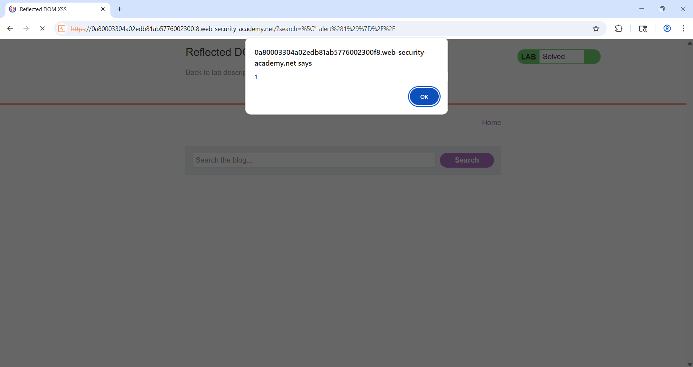

*Slika 11. Prikaz stranice sa alert-om*
