# Login Bypass

## Uvod

Zaobilaženje mehanizma prijave (*Login Bypass*) predstavlja ozbiljnu
bezbednosnu ranjivost koja omogućava neautoriyovanom korisniku pristup
zaštićenim delovima aplikacije bez potrebe za validnim korisničkim
kredencijalima. Ova ranjivost narušava sam temelj autentikacije i
autorizacije, dozvoljavajući napadaču da se predstavi kao drugi
korisnik, uključujući i administrativne naloge. U kontekstu veb
aplikacija, login bypass može nastati usled loše implementacije sesija,
kolačića, JWT tokena ili drugih mehanizama za upravljanje identitetom.
Posledice mogu biti katastrofalne: od neovlašćenog pristupa osetljivim
podacima do potpune kompromitacije sistema.

TUDO aplikacija je jednostavna PHP-based platforma za upravljanje
fajlovima, slična po funkcionalnosti uslugama poput Dropbox-a. Korisnici
mogu da se registruju, prijave, otpremaju i preuzimaju fajlove.

Tokom procesa *whitebox penetration testa* nad TUDO aplikacijom izvršena
je statička analiza koda korišćenjem alata **Progpilot**. Cilj je bio da
se identifikuju ranjivosti, među kojima je i ***Login Bypass***, tj.
Zaobilaženje autentikacionog mehanizma. Ova ranjivost omogućava napadaču
da se neautentifikovan domogne privilegovanog naloga.

## Rezultati statičke analize

Alat **Progpilot** je otkrio više ranjivosti u aplikaciji, uključujući:

- **SQL Injection (CWE-89)** u fajlu *forgotusername.php* – promenljiva
  \$username direktno se prosleđuje funkciji *pg_query* bez
  sanitizacije.

- **XSS (CWE-79)** na više mesta u *index.php, profile.php* i
  *resetpassword.php*.

- **Code Injection (CWE-95)** kroz upotrebu funkcije *unserialize* u
  *import_user.php*.

Za potrebe ovog izveštaja fokus je na SQL Injection ranjivosti u
*forgotusername.php*, jer je ona direktno korišćena za Login Bypass.
Detaljne rezultate statičkim alatom Progpilot možete pogledati u JSON
fajlu u folderu *reports*.

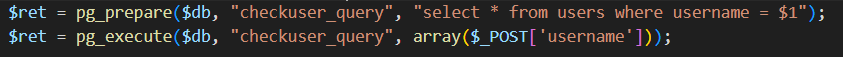

Slika 1. Prikaz ranjivog koda u fajlu *forgotpassword.php*

Iako se koriste parametrizovani upiti (što bi trebalo da spreči SQL
injekciju), postoji specifična logička greška u kodu:

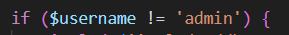

Slika 2. Prikaz logičke greške u kodu u fajlu *forgotpassword.php*

SQL upit se izvršava samo za one koji nisu ‘admin’. Ovo ograničenje
omogućava napadaču da izbegne SQL upit za admin nalog, ali istovremeno
ostavlja mogućnost za ***Boolean-based SQL injection*** za sve druge
korisnike.

## Opis ranjivosti

Zbog nedostatka validacije i parametarskih upita, korisnički unos se
konkatenira direktno u SQL upit. Ovo otvara mogućnost napadaču da unese
maliciozan SQL payload, čime može:

- Izmeniti logiku upita,

- Enumerisati korisničke naloge,

- Doći do reset tokena,

- I zaobići standardni login mehanizam.

## Eksploatacija - Login Bypass

Za demonstraciju je razvijen Python exploit (TUDOExploit klasa) koji
automatizuje ceo lanac napada.

**Koraci u exploit skripti:**

1.  **Uvoz biblioteka**

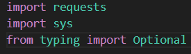

Uvozimo sledeće biblioteke:

- Requests – HTTP klijent; koristi se jedna ***Session*** instanca da
  deli kolačiće i zaglavlja kroz sve zahteve.

- Sys – čitanje argumenata iz komandne linije (u ovom slučaju imamo samo
  jedan argument i to je IP adresa, odnosno cilj).

- typing.Optional – tipovi za anotacije

2.  **Definisanje klase TUDOExploit**

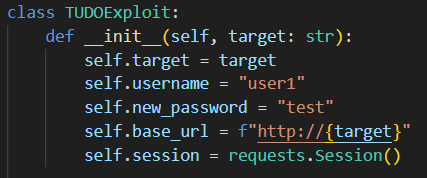

Inicijalizacija klase koja će izvršiti eksploataciju. Ova klasa:

- Pamti IP/host cilja (self.target)

- Hardcoduje korisnika koji se napada: *user1* i novu lozinku *test*.

- Sklapa bazni URL http://\<target\>

- Kreira jednu requests.Session() da bi zadržala kolačiće (npr. Session
  id kroz sve korake).

3.  **Metoda request_reset**

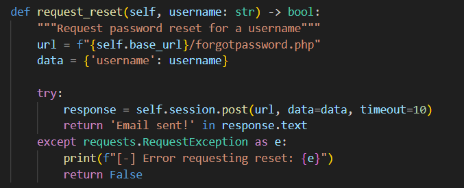

Ova metoda:

- Gađa POST /forgotpassword.php sa telom {‘username’: \<username\>}.

- Ako u HTML odgovoru postoji fraza ‘Email sent!’, vraća True
  (pretpostavka: aplikacija upravo kreira reset token).

- U suprotnom False, pri čemu hvata i mrežne greške.

4.  **Metoda *oracle* (ključna za SQL injection)**

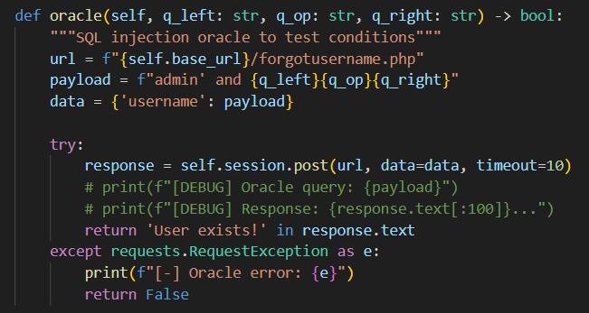

Ova metoda:

- Gađa POST /forgotusername.php sa poljem username.

- Sastavlja payload: admin’ and {q_left}{q_op}{q_right}

  - Admin’ zatvara ‘ u SQL stringu na serveru (npr. WHERE username =
    ‘\<ovde\>’), pa posle toga može da ide uslov AND … .

  - Primer u testu: q_left = “1”, q_op=”=”, q_right=”’1” → deo uslova
    postaje 1=’1 a zatvarajući ‘ dodaje sam server na kraju korisničkog
    unosa, pa se efektivno dobija 1=’1’.

- Šalje zahtev i gleda da li odgovor sadrži User exists!. Ako da, uslov
  u SQL-u je bio True, pa vraća True. ako ne, False. Dakle, ovo je
  boolean-based blind SQLi oracle: tačno/netačno zaključujemo na osnovu
  teksta na strani.

5.  **Metoda change_password**

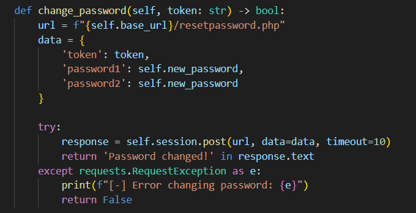

Ova metoda gađa POST /resetpassword.php sa token, password1, password2
(i password1 i password2 su postavljeni na vrednost self.new_password).

Ako odgovor sadrži *Password changed*, vraća se True, u suprotnom, vraća
se False uz odgovarajuću poruku o grešci.

6.  **Metoda *test_vulnerability***

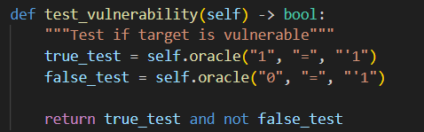

Ova metoda testira da li je cilj ranjiv na SQL injection tako što šalje
tačan i netačan uslov.

Ovo su zapravo dva brza testa oracle metode gde je:

- U prvim slučaju očekivano True (1=’1’)

- U drugom slučaju očekivano je False (0=’1’)

Aplikacija se smatra “ranjivom” ako je prvi uslov ispunjen, a drugi ne.

7.  **Metoda dump_uid**

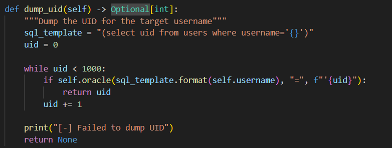

Ova metoda pronalazi UID (User ID) korisnika metodom brute force-a,
testirajući sve vrednosti od 0 do 999.

Imamo šablon (select uid from users where username=’{}’). Isprobavamo za
vrednosti UID-a od 0 do 999:

- Oracle metodi se šalje “(subquery) = ‘X” (pri čemu se ponovo oslanjamo
  na server da zatvori poslednji ‘).

- Kada oracle vrati True, to znači da je pogodio UID i vraća ga.

- Ako ga ne pronađe u ovom opsegu, onda vraća None.

8.  **Metoda *dump_token***

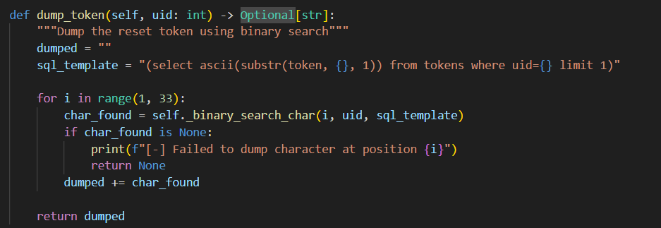

Ova metoda koristi binarnu pretragu za ekstrakciju tokena karakter po
karakter. To radi tako što:

- Pretposravlja da je dužina tokena 32 i prolazi pozicije od 1 do 32.

- Koristi sledeći šablon za svaki karakter: (select ascii(substr(token,
  {pos}, 1)) from tokens where uid={uid} limit 1)

- Za svaku od ovih pozicija poziva metodu *binary*\_search_char(...) da
  otkrije ASCII vrednost tog karaktera i dodaje ga u string *dumped*.

9.  **Metoda *\_binary_search_char***

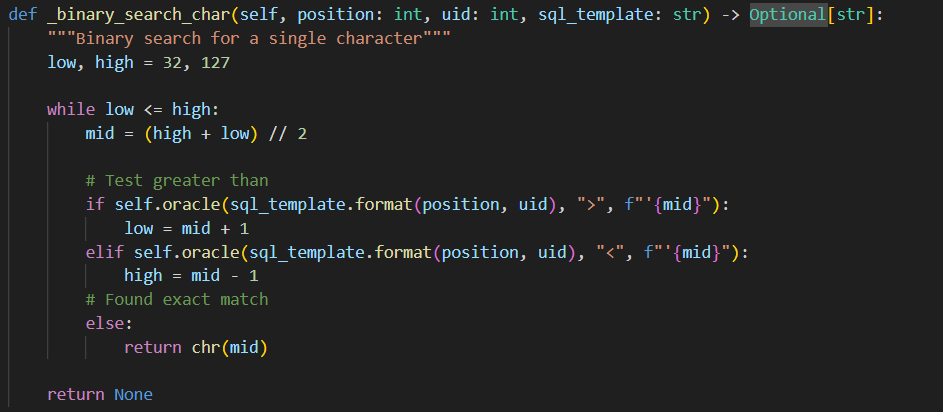

Ova metoda koristi binarnu pretragu da pronađe ASCII vrednost karaktera
na određenoj poziciji u tokenu.

Na početku metode postavljamo opseg ASCII kodova, od 32 do 127 (štampani
karakteri).

Zatim se radi standardna binarna pretraga:

- U oracle metodu se prosleđuje vrednost mid sa pitanjem da li je
  vrednost veća od mid, ako jeste, pomera se low (povećava se za 1).

- Ako prvi uslov nije ispunjen, postavlja se pitanje da li je vrednost
  manja od vrednosti mid, ako jeste, pomera se vrednost high (smanjuje
  se za 1).

- Ako nijedan od prethodnih uslova nije ispunjen, zaključuje se da su
  jednaki i vraća se karakter na poziciji mid.

Ako se iz nekog razloga opseg “isprazni”, onda se vraća None.

10. **Metoda *login***

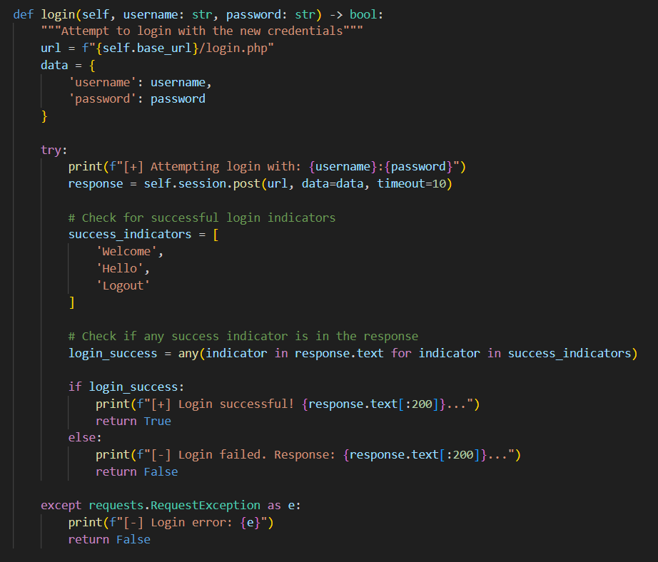

Ova metoda pokušava da se prijavi sa novom lozinkom i proverava
uspešnost prijave.

Gađa se POST /login.php sa kredencijalima. Zatim se vrši heuristička
provera uspeha tako što se traži neka od reči Welcome / Hello / Logout u
odgovoru. Kao vid dodatne provere, štampa se prvih 200 karaktera
odgovora.

Ukoliko je prijava uspešna, vraća se True. Ukoliko prijava nije uspešno
izvršena, vraća se False zajedno sa odgovarajućim opisom greške.

11. **Metoda *execute***

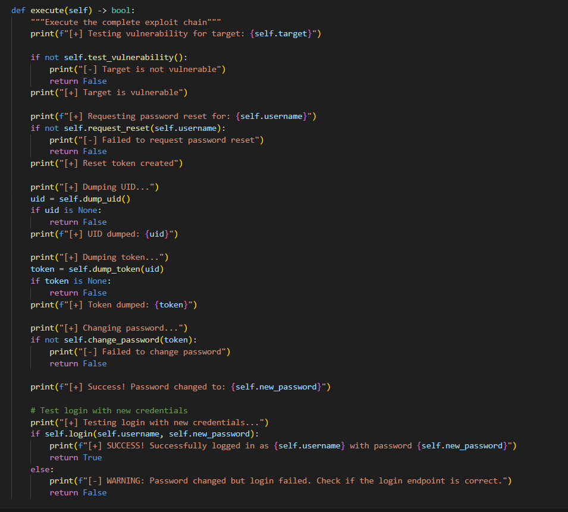

Ova metoda je glavna metoda programa koja koordinira ceo proces
eksploatacije korak po korak i funkcioniše na sledeći način:

1.  Testira ranjivost aplikacije metodom test_vulnerability

2.  Traži reset token za ciljanog korisnika (u ovom slučaju je to user1)
    metodom request_reset. Ovime se osigurava da postoji svež token u
    bazi.

3.  Vrši dump-ovanje UID-a za ciljanog korisnika metodom dump_uid.

4.  Vrši dump-ovanje celog reset tokena znak po znak kombinacijom metode
    dump_token i binarne pretrage.

5.  Menja lozinku na novu vrednost u metodi change_password.

6.  Proverava da li se može ulogovati novom lozinkom metodom login.

7.  Vraća True za potpuni uspeh, a u suprotnom vraća False. Usput
    ispisuje poruke kako bismo lakše pratili gde je nastao problem.

<!-- -->

12. ***Main* metoda**

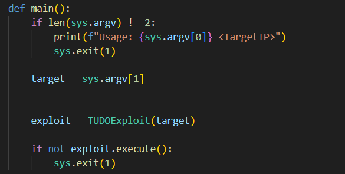

Ova metoda proverava argumente komandne linije, kreira objekat
eksploatacije i pokreće je.

Očekuje tačno jedan argument komandne linije i to je TargetIP ili host.

Vrši kreiranje TUDOExplot objekta i poziva funkciju execute.

Ako execute vrati False, proces se završava statusom 1 koji označava
grešku.

## 5. Mitigacije

Mitigacije za problem koji exploit gađa (SQL Injection → login bypass na
forgot username.php + reset password chain) se mogu podeliti na 3 nivoa:

- Mitigacije na nivou koda

- Mitigacije na nivou baza

- Mitigacije na nivou aplikacije

### Mitigacije na nivou koda

1.  **Koristiti parametarske upite (prepared statements)** umesto
    konkatenacije stringova:

Primer:

\$username = \$\_POST\['username'\];

\$stmt = \$pdo-\>prepare("SELECT \* FROM users WHERE username =
:username");

\$stmt-\>execute(\['username' =\> \$username\]);

Ovo automatski escape-uje korisnički unos i sprečava SQLi.

2.  **Validacija ulaza**

    1.  Dozvoliti samo očekivane vrednosti. Ovo se može uraditi na
        primer korišćenjem regex-a za username gde ćemo postaviti da
        username može sadržati slova i brojeve i biti maksimalne dužine
        30 karaktera.

    2.  Odbacićemo sve što sadrži ‘, “, ;, – i druge SQL specijalne
        znakove.

3.  **Princip najmanjih privilegija**

    1.  Korisnički nalog baze koji koristi aplikacija ne treba da ima
        DROP/DELETE/UPDATE ovlašćenja, već samo ono što je nužno.

    2.  Tako, i ako dođe do SQLi, napadač ima najmanji prostor za štetu.

### Mitigacije na nivou baze

4.  **Ograničavanje grešaka i informacija**

    1.  Ne vraćati korisniku detaljne SQL greške.

    2.  Umesto *User exists! / User not found!*, koristiti neutralne
        poruke poput: “*Ako postoji nalog sa tim korisničkim imenom,
        poslaćemo Vam e-mail.”*

5.  ***Rate limiting i monitoring***

    1.  Sprečiti brute-force i binarne pretrage (kao u dump_token
        funkciji) ograničavanjem broja pokušaja.

    2.  Logovati i analizirati sumnjive upite.

### Mitigacije na nivou aplikacije

6.  **CSRF zaštita za reset lozinke**

    1.  Reset token mora biti jedinstven, nasumičan, vremenski ograničen
        i vezan za korisnika + CSRF token u formi.

7.  **Sigurnija procedura za reset lozinke**

    1.  Token ne sme biti predvidljiv i ne sme se čuvati u čistom
        tekstu.

    2.  Koristiti kriptografski siguran random generator i čuvati heš
        (npr. Upotrebom algoritma SHA-256).

    3.  Token važi samo određeni vremenski period (npr. 15 minuta).

8.  **Zaštita kolačića i sesija**

    1.  Dodati HttpOnly, Secure i SameSite flagove.

    2.  Na login/resetu uvek rotirati session ID (sprečava session
        fixation).

9.  **Redovno testiranje i code review**

    1.  Uvesti statičku i dinamičku analizu (npr. SonarQube, Progpilot,
        OWASP ZAP) u CI/CD pipeline.

    2.  Detaljno pregledati kod pre deploy-a.
