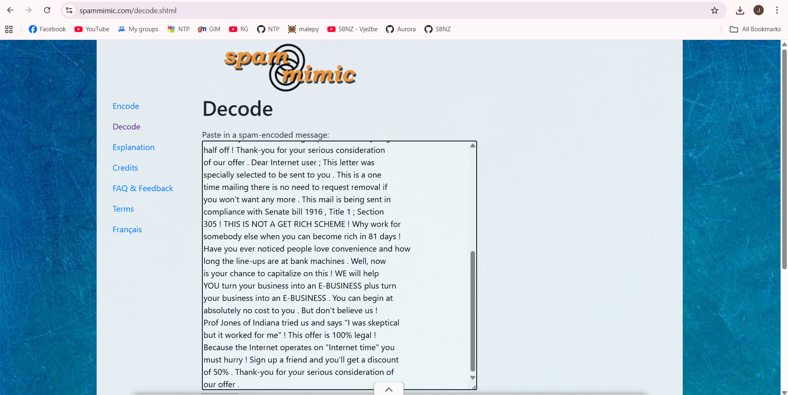

# Zadatak 4 - Nigerian Prince

Prvo što radimo jeste dekodiranje mejla pomoću alata
[[spammimic]{.underline}](https://www.spammimic.com/decode.cgi). Ovaj
alat ima mogućnost dekoridanja sumnjivih imejl poruka i otkirivanja
skrivenih poruka u njima.

Nakon izvršenog dekodiranja teksta imejl poruke, dobili smo sledeći
flag: **UNS{EM4IL_5P4M_AG4N?}**

{width="6.5in"
height="3.263888888888889in"}

{width="6.5in" height="3.263888888888889in"}

{width="6.5in"
height="3.2777777777777777in"}

*Prikaz rezultata dekodiranja*

# Zadatak 8 - Squid Game Invitation

Na slici koju smo dobili uz zadatak uočili smo gmail adresu
[[squidgameph1337@gmail.com]{.underline}](mailto:squidgameph1337@gmail.com).
Pretpostavili smo da se prvi deo gmail adrese mogao iskoristiti kao
korisničko ime za registraciju na nekim onlajn servisima. Nakon provere
nekoliko različitih onlajn servisa, pronašli smo nalog sa istim
korisničkim imenom i imejl adresom na GitHub-u.

{width="6.5in"
height="3.2777777777777777in"}

{width="6.5in"
height="3.2777777777777777in"}

Na GitHub profilu korisnika *squidgameph1337* uočavamo jedan
repozitorijum i ulazimo u njega kako bismo videli šta se tu nalazi.

Prošli smo kroz sve fajlove i u fajlu index.html smo uočili vrednost
čiji format odgovara formatu flag-a koji se traži:

{width="6.5in"
height="3.2916666666666665in"}

Vrednost traženog flag-a je: **NAVY{h4v3_y0u_3v3r_w4tched\_!t?}**

# Sakura Challenge

## Zadatak 3: RECONNAISSANCE

Cilj ovog zadatka je pronaći imejl adresu i puno ime napadača na osnovu
njegovog korisničkog imena koje smo pronašli u Zadatku 2
(SakuraSnowAngelAiko).

Prvi korak je da pronađemo na kojim onlajn servisima postoji nalog sa
takvim korisničkim imenom. Za tu namenu korišćen je alat
[[whatsmyname]{.underline}](https://whatsmyname.me/).

{width="6.5in"
height="2.1805555555555554in"}

Nakon izvršene pretrage, vidimo da nalog sa istim korisničkim imenom
postoji na nekoliko sajtova (TikTok, GitHub, SourceForge i Udemy).
Posećujemo svaki od ponuđenih linkova i tražimo potrebne informacije. Na
GitHub nalogu pronalazimo više repozitorijuma i proveravamo svaki od
njih. U repozitorijumu GPG pronalazimo javni ključ napadača.

{width="5.244792213473316in"
height="2.656015966754156in"}

{width="6.5in"
height="3.2777777777777777in"}

Kopirala sam ključ iz publickey fajla u repozitorijumu GPG i nalepila ga
u onlajn alat za dekodiranje GPG ključeva
[[cirw]{.underline}](https://cirw.in/gpg-decoder/).

U jednom delu ključa je pronašao sledeću imejl adresu:

{width="6.5in"
height="1.0555555555555556in"}

Uzimam tu imejl adresu i kopiram je u Sakuru.

{width="6.5in"
height="0.5972222222222222in"}Odgovor je tačan i time je ovaj deo
zadatka rešen. Zatim prelazim na pronalazak punog imena napadača. Pošto
nam pretraga korisničkog imena specijalizovanim alatom nije dala
zadovoljavajuće rezultate za rešavanje ovog problema, odlučila sam da
izvršim ručnu pretragu tako što ću izvršiti Gugl pretragu korisničkog
imena.

{width="6.5in"
height="3.6666666666666665in"}

Postoji i X nalog sa istim korisničkim imenom, pa ulazim da proverim šta
tu ima.

{width="6.5in"
height="1.5833333333333333in"}

Napadač se u jednom postu predstavio kao AikoAbe3, pa ulazimo u taj
nalog.

{width="2.1406255468066493in"
height="3.123727034120735in"}

Pošto tu nema nikakvih novih informacija, pretpostavljam da je ime
napadača Aiko Abe i to unosim u polje za odgovor u Sakura Room-u.

{width="6.5in"
height="1.0972222222222223in"}

Odgovor je tačan i time je ovaj zadatak u potpunosti rešen.

## Zadatak 4: UNVEIL

Cilj ovog zadatka je pronaći sledeće informacije o napadaču:

1.  Za koju kriptovalutu napadač poseduje kripto-novčanik?

2.  Koja je adresa kripto-novčanika napadača?

3.  Od kog *mining pool*-a je napadač primio uplate 23. januara 2021.
    UTC?

4.  Kojom drugom kriptovalutom je napadač trgovao (ili razmenjivao)
    koristeći svoj kripto-novčanik?

Pregledom GitHub naloga napadača, dolazimo do repozitorijuma ETH u kome
se nalazi samo jedan fajl pod imenom miningscript.

{width="6.5in" height="3.25in"}

{width="6.5in" height="3.263888888888889in"}

Vidimo da je bilo više od jednog *commit*-a u ovom repozitorijumu, pa
ulazimo u istoriju *commit*-ova kako bismo videli da li u ranijim
izmenama ima nečega što bi moglo da nam bude od koristi.

{width="6.5in"
height="2.1666666666666665in"}

Ulazimo u prvi od ovih *commit*-ova kako bismo videli kako je izgledala
inicijalna verzija *miningscript* fajla.

{width="6.5in" height="3.25in"}

Uočavamo neki link i odlučujemo da ga kopiramo u browser.

{width="6.5in"
height="2.2083333333333335in"}

Prvi rezultat na Guglu nam kaže da je to *blockchain* adresa za
*Ethereum* novčanik i to nam je odgovor na prvo pitanje. U Sakura Room-u
kao odgovor na prvo pitanje unosimo "Ethereum" i proveravamo rezultat.

{width="6.5in"
height="0.5416666666666666in"}

Ispostavilo se da je to tačan odgovor, pa prelazimo na sledeće pitanje.

Ulazimo na sajt
[[blockchain.com]{.underline}](https://www.blockchain.com/explorer/addresses/eth/0xa102397dbeeBeFD8cD2F73A89122fCdB53abB6ef)
otvara nam se kripto-novčanik napadača. U polju za URL imamo deo
*/adresses/0xa102397dbeebefd8cd2f73a89122fcdb53abb6ef* pa
pretpostavljamo da je *0xa102397dbeebefd8cd2f73a89122fcdb53abb6ef*
adresa kripto-novčanika napadača i to unosimo kao odgovor na drugo
pitanje iz *Sakura Room*-a. Ispostavlja se da je to tačan odgovor.

{width="6.5in"
height="0.3611111111111111in"}

{width="6.5in"
height="0.5277777777777778in"}

Kako bismo pronašli odgovor za treće pitanje, neophodno je da pregledamo
istoriju transakcija na sajtu
[[blockchain.com]{.underline}](https://www.blockchain.com/explorer/addresses/eth/0xa102397dbeeBeFD8cD2F73A89122fCdB53abB6ef)
i pronađemo dolaznu transakciju sa datumom 23. Januar 2021. Godine.

{width="6.5in"
height="0.4305555555555556in"}

Pronalazimo dolaznu transakciju sa tim datumom i uočavamo da je
pristigla od *mining pool*-a pod nazivom *Ethermine*, te to unosimo kao
odgovor na treće pitanje u *Sakura Room*-u. To se ispostavlja kao tačan
odgovor.

{width="6.5in"
height="0.5138888888888888in"}

Kako bismo odgovorili na poslednje pitanje, neophodno je da još jednom
prođemo kroz istoriju transakcija.

Uočavamo da je napadač više puta izvršio konverzije iz ETH u Tether
USDT, te odlučujemo da isprobamo Tether kao odgovor u Sakura Room-u.

{width="6.5in"
height="1.5416666666666667in"}

To se ispostavilo kao tačan odgovor i time je ovaj zadatak u potpunosti
rešen.

{width="6.5in" height="2.138888888888889in"}
